# Configure Launchpad
<!-- description --> Configure launchpad for visibility scenario

## Prerequisites
 - Space in BTP Cockpit subaccount created

## You will learn
  - How to configure launchpad in **SAP BTP Cockpit** to gain visibility in your dashboard

## Intro
In this tutorial, you will configure everything needed for the creation of a launchpad dashboard in **SAP BTP Cockpit** to gain visibility of your processes.

---

### Add entitlement

1.  Navigate to **SAP BTP Cockpit** subaccount and select **Entitlements**.

    <!-- border -->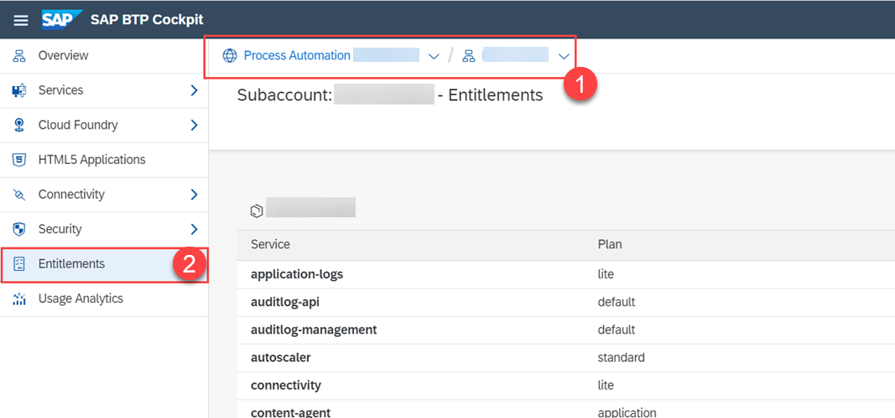

2.  Search **Launchpad Service** in the search bar.
    > If it is already added, skip to the next step of this tutorial.

    <!-- border -->

3.  Choose **Add Service Plans**.

    <!-- border -->

4.  Search **Launchpad Service**:
    - Select **Launchpad Service** from the options shown.
    - Select **standard (Application)**.
    - Choose **Add 1 Service Plan**.

    <!-- border -->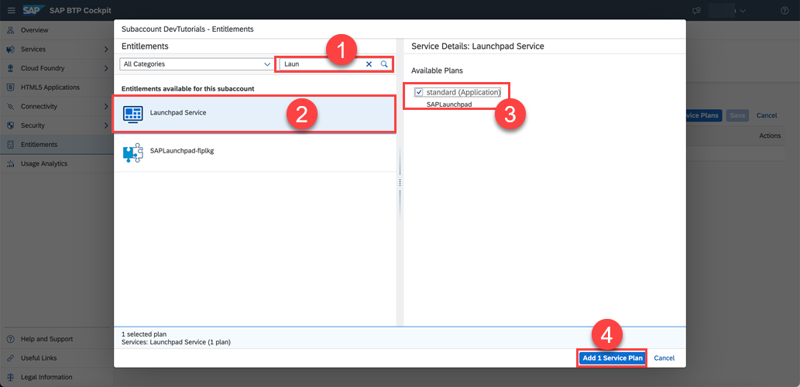

5.  Choose **Save**.

    <!-- border -->

    **Launchpad Service** entitlement has now been added.

### Create a new subscription

1.  Navigate to **SAP BTP Cockpit** subaccount > **Services** > **Instances and subscriptions**.

2.  Choose **Create**.

    <!-- border -->

3.  For the new subscription:
    -  Select **Launchpad Service** as a **Service**.
    -  Select your plan from the **Plan** list.
    -  Choose **Create**.
    <!-- border -->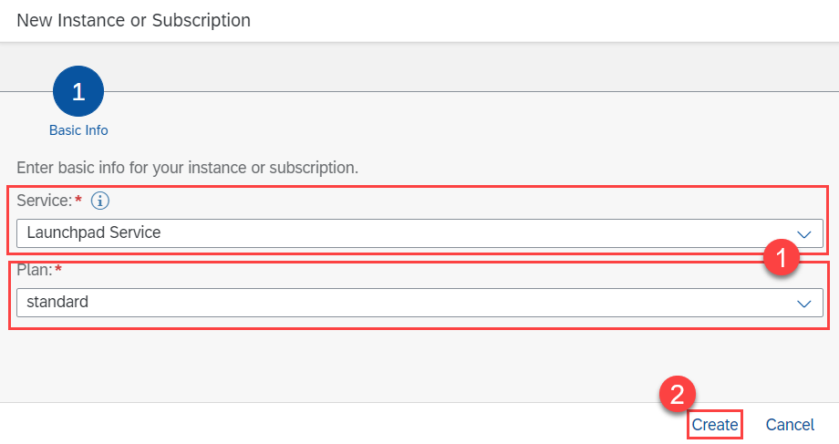

    The subscription is now added.

    <!-- border -->

### Assign roles to users

1.  Navigate to **SAP BTP Cockpit** subaccount > **Security** > **Users**.

    <!-- border -->

2.  Select the user to whom you will give the roles then on **Enter Full-Screen Mode** .

    <!-- border -->

3.  Choose **Assign Role Collection**.

    <!-- border -->

4.  Select **Launchpad Admin** and **Launchpad External User** then choose **Assign Role Collection**.

    > Launchpad Admin is the role for whom is going to design the launchpad in the launchpad editor.
    >
    > Launchpad external user is the role for whom accesses the final launchpad.
    >
    > Note: Launchpad Admin shouldn't be given to all users for security purposes.

    <!-- border -->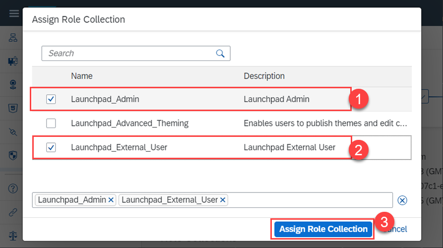

    The roles are assigned.

    <!-- border -->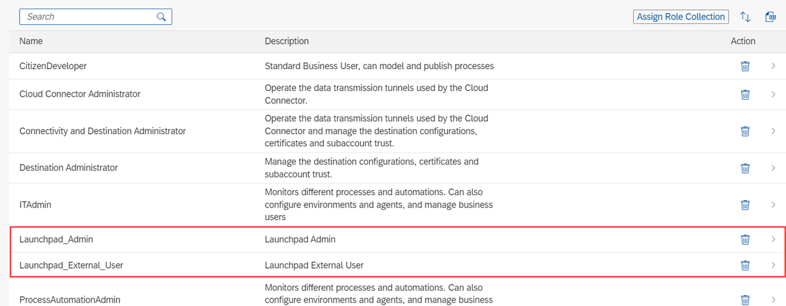

### Create SAP Build Process Automation instance

1.  Navigate to **SAP BTP Cockpit** subaccount > **Services** > **Instances and subscriptions**.

2.  Choose **Create**.

    <!-- border -->

3.  For the new instance:
    -  Select **SAP Build Process Automation** as a **Service**.
    -  Select **Instance** plan from the **Plan** list.
    -  Select **Cloud Foundry** as **Runtime Environment**.
    -  Select a space from **Space** list.
    -  Set **Instance Name** as **SPA-instance**.
    -  Choose **Create**.

    <!-- border -->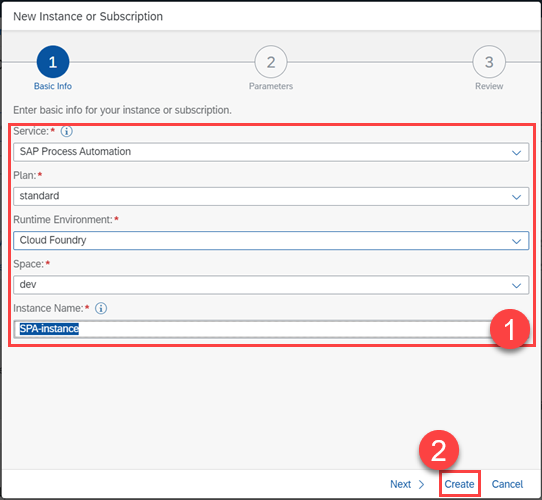

    The instance was added.

    <!-- border -->

### Create a new destination

1.  Navigate to **SAP BTP Cockpit** subaccount > **Connectivity** > **Destinations**.

    <!-- border -->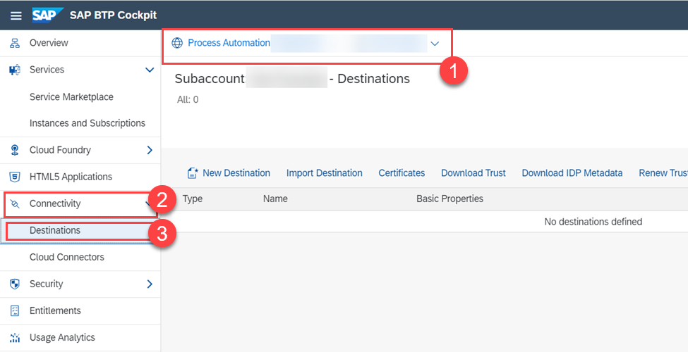

2.  To create a new destination:
    -  Choose **New Destination**.
    -  Select **Service Instance**.
    -  Set **Service Instance** to **SPA-instance** that you created in Step **4.3**.
    -  Set **Name** to **spa-launchpad**.
    -  Choose **Next**.

    <!-- border -->

3.  Choose **Save**.

    <!-- border -->

    The new destination was created.

### Open launchpad editor

1.  Navigate back to **SAP BTP Cockpit** subaccount > **Services** > **Instances and Subscriptions**.

2.  Choose **Go to Application** on **Launchpad Service** in **Applications** tab.

    <!-- border -->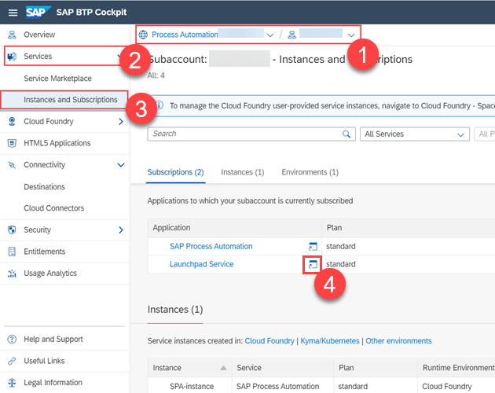

3. Your launchpad is now ready to be created and designed with **Launchpad Editor**.

    <!-- border -->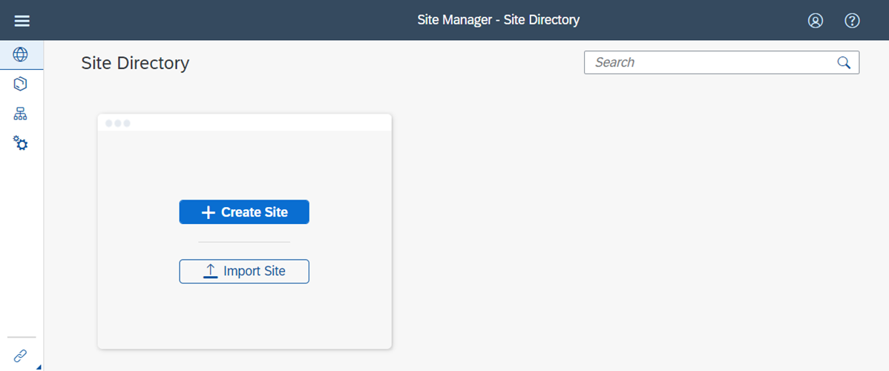

1.  Select **Provider Manager**.

    <!-- border -->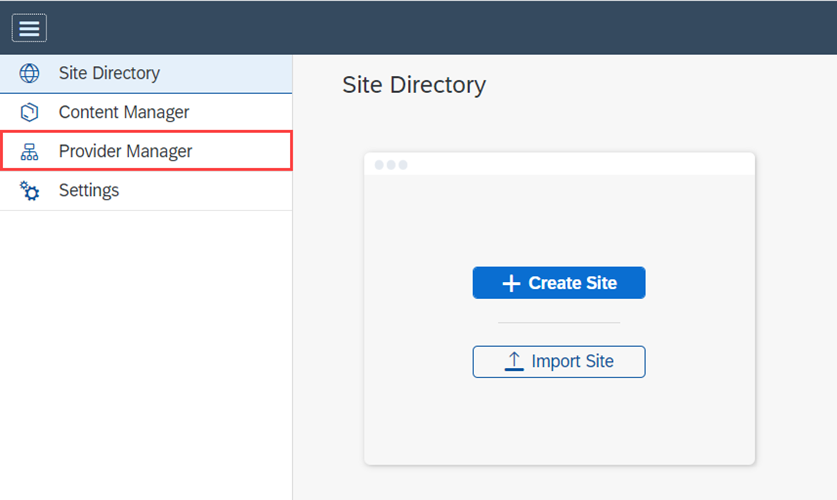

2.  Choose **Update Content**.

    <!-- border -->

    > The content updates and the status changes to Activated.

3.  Select **Content Manager**.

4.  On the top two tabs select **Content Explorer**.

4.  Select **HTML5 Apps**.

    <!-- border -->

5.  Select all items and click **+ Add to My Content**.

    <!-- border -->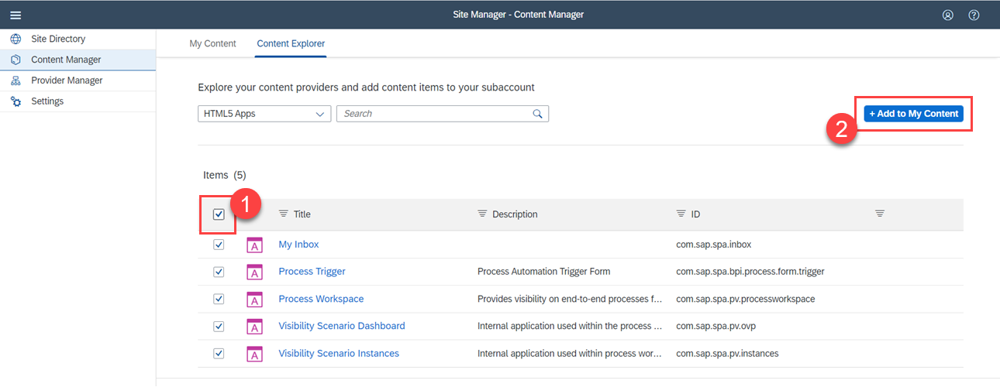

6.  Navigate to **Content Manager** > **My Content**.

7.  Choose **New** and select **Group**.

    <!-- border -->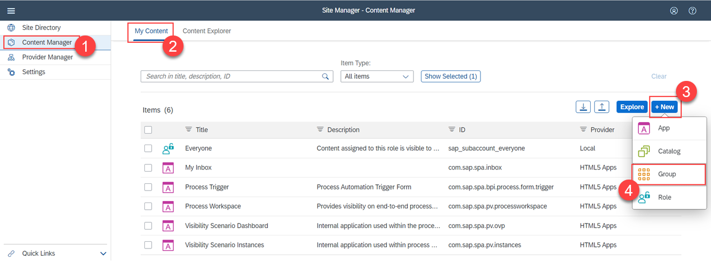

8.  Set **Title** to **SAP Build Process Automation**.

9.  Assign **My Inbox** and **Process Workspace** to the group.

10. **Save** and go back.

    <!-- border -->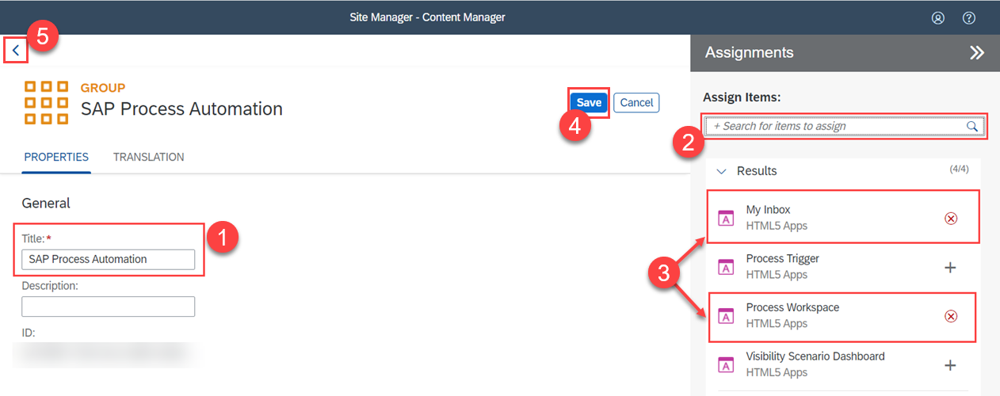

11.  Choose **Everyone** role to edit it.

    <!-- border -->

12.  Select **Edit** to edit role.

    <!-- border -->

13.  Assign **My Inbox**, **Process Workspace**, **Visibility Scenario Dashboard** and **Visibility Scenario Instances** to **Everyone** role then click **Save**.

    <!-- border -->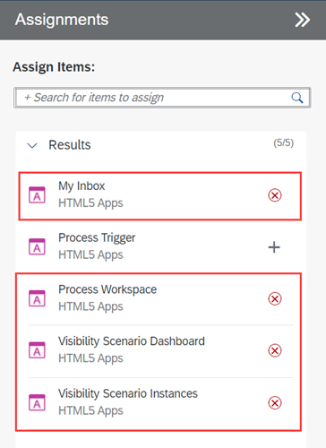

---
