# Build Your First Automation Using Excel SDK of SAP Process Automation
<!-- description --> In this tutorial, you will be developing basic automations using Excel SDK. In the end, you know how to read Excel data for a given range using Excel Cloud Link, or using a traditional approach. In this tutorial, you will also learn, how you can apply filter on the Excel data, copy the filtered data onto a new Excel sheet and save the file with a new name.

## Prerequisites
- Complete the tutorial: [Subscribe to SAP Process Automation Using Booster in SAP BTP Free Tier](spa-subscribe-booster)
- [Install and Setup the Desktop Agent](spa-setup-desktop-3-0-agent)
- Basic understanding of SAP Process Automation

## You will learn
  - How to use Excel SDK of SAP Process Automation (SPA) to read and process data in an Excel

## Intro
  SAP Process Automation has native integration to several Microsoft Office products including Outlook, Excel SDK. In this Tutorial, you will explore how to use Excel SDK to your automations.

---

### About Excel SDK

SAP Process Automation has native integration to several Microsoft Office products including Outlook and Excel SDK. In this Tutorial, you will explore how to use Excel SDK to your automations.

The Excel SDK is a collection of activities allowing you to create automations using Microsoft Excel.
It comes with rich set of functionality. For example,

- Create new Excel Workbook
- Create new Excel Worksheet
- Read and write data from an Excel sheet, for a given data range
- Apply Filter on the a column
- etc

To design your automation, you will need an Excel file filled with the sales orders data. You have the possibility to create it yourself using the below sample data:

| Order Number| Order Amount | Order Date | Shipping Country         | Expected Delivery Date | Order Status
|  :----------| :------------|:-----------| :------------------------|:-----------------------|:-----------
|  PO7991     | 410418.22    | 1/21/2022	| United States of America | 1/29/2022	            | In Time
|  PO7918     | 150935.13	   | 1/22/2022	| United Kingdom           | 1/27/2022	            | Urgent
|  PO7375     | 313977.82	   | 1/23/2022	| United Kingdom	         | 2/20/2022              | In Time
|  PO7311     | 755055.4	   | 1/24/2022	| United Kingdom	         | 3/30/2022              | In Time
|  PO6858     | 429358.4     | 1/25/2022	| United Kingdom	         | 2/20/2022	            | In Time
|  PO6368     | 43739.82	   | 1/26/2022	| United Kingdom	         | 3/25/2022	            | In Time
|  PO6189     | 483574.12	   | 1/27/2022	| Germany	                 | 2/5/2022	              | In Time
|  PO3115     | 2739956	     | 1/28/2022	| Germany	                 | 3/10/2022	            | In Time
|  PO2686     | 220887.56	   | 1/29/2022	| Germany	                 | 3/5/2022	              | In Time
|  PO8282     | 436955.64	   | 1/30/2022	| United States of America | 3/30/2022	            | In Time

or you can use an Excel sample of your choice

### Use Excel Link in your Excel Automations

1.  From the SAP Process Automation Lobby, create a new automation.
2.  Provide an appropriate name to your project and relevant automations.
3.  Select your active desktop agent version to be used during design and development of your automation.
4.  By Default Excel and Core SDK are added to the automations and your automation opens in a new browser tab. You have couple of ways to read Excel Data.
      - Using the activity **Excel Cloud Link** to achieve Excel Data Mapping
      - Traditional step by step approach to read / write Excel data

      In this tutorial, you will explore both ways.

    >**What is Excel Data Mapping?**

    > Excel Data Mapping allows you to transform columns-based data from an Excel sheet into datatype that can be used in your automation. The data from the Excel sheet stays the same but the structure becomes a data type structure, making it possible to use throughout your project.

5.  As a first step, Locate and add **Open Excel Instance** activity to the automation flow
    <!-- border -->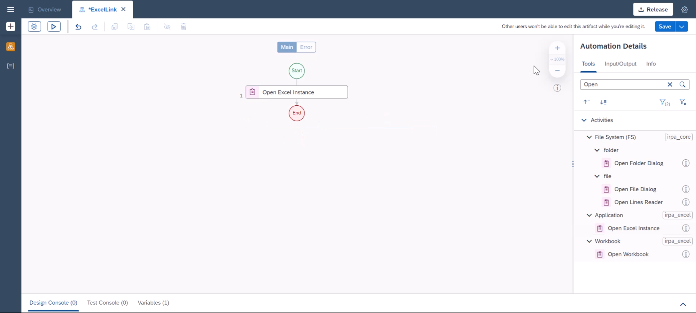

6.  Similarly locate and add **Excel Cloud Link** from the activity pane
    <!-- border -->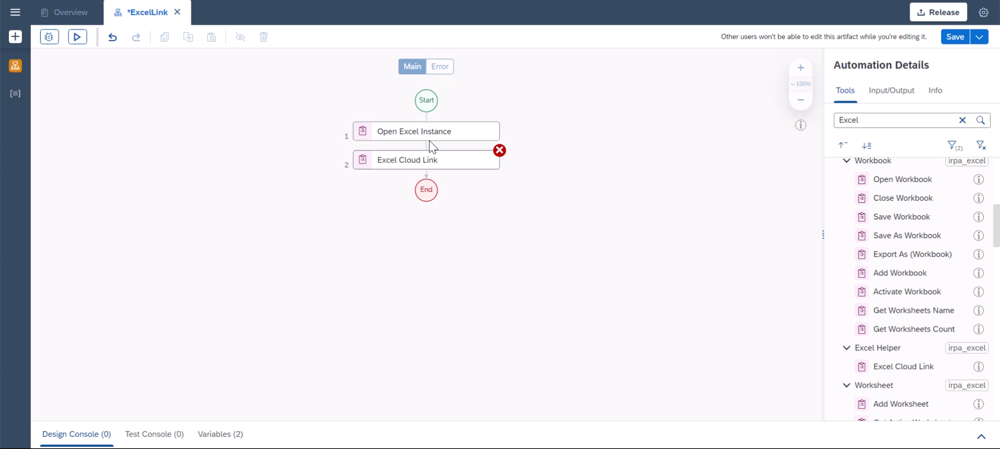

7.  Now edit the properties of **Excel Cloud Link** activity. In the flow chart, select the **Excel Cloud Link** activity, on the right side menu, click **Edit Activity** button
    <!-- border -->

8.  Within the edit activity screen, you can either use the file picker or drag and drop your test Excel.
    <!-- border -->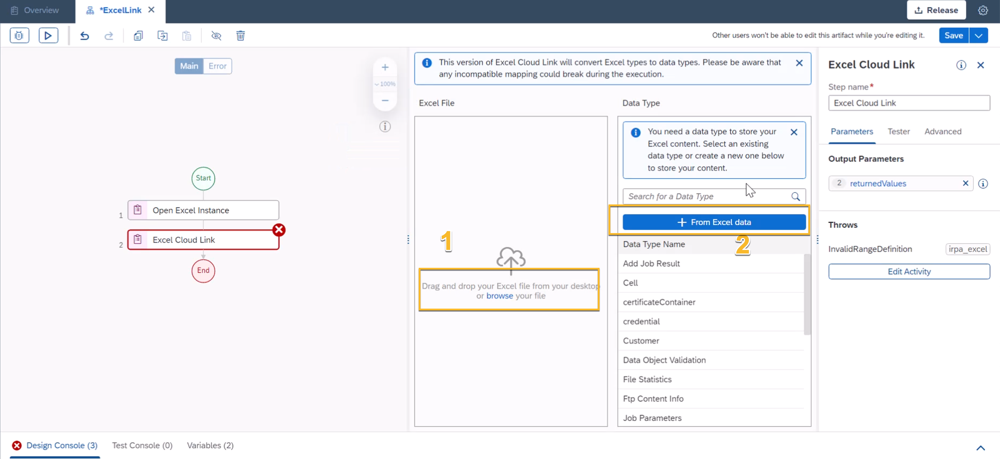

9.  You can see, the Excel cloud link capabilities, it already pre-selects the first sheet, it groups data by column names, it also finds out in few seconds the complete range of the Excel
    <!-- border -->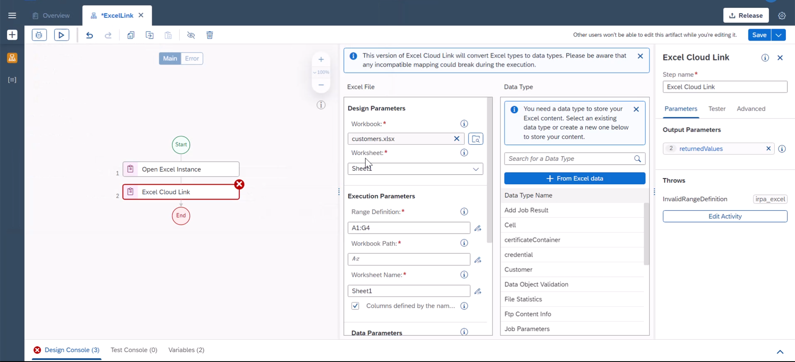

10. While Excel cloud link is great in processing the data, it still needs for runtime reference, the path of your Excel. Typically you needed the full path of the Excel. i.e. `folder path + file name`. Please provide your full path location into the path field.
    <!-- border -->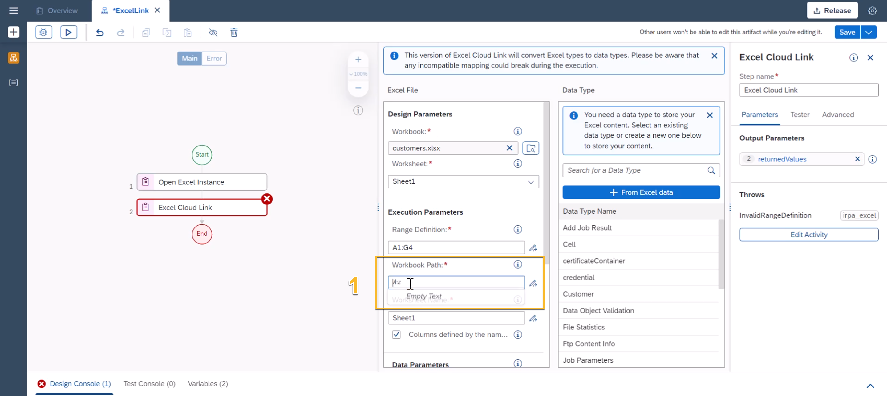

11. SAP Process Automation has data type functionality to logically group and process your data. You can create a data type out of the added Excel by using the Excel data structure (2)
    <!-- border -->

12. Provide a data type name, As you can see **Excel Cloud Link** already identifies field names using the first row of each column in your Excel and determines the field type based on the type of data present in each column below the first row.
    <!-- border -->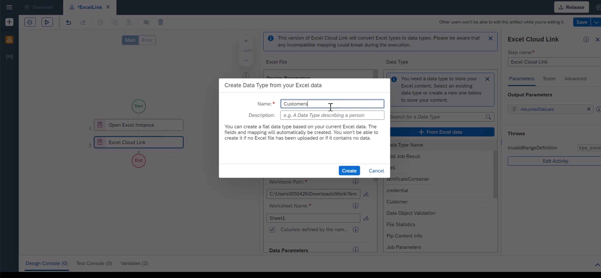

13. All that **Excel Cloud Link** does is, it is a helper function to read given range of data in your Excel. this will be returned through the **Output Parameter**. If you prefer you can edit output parameter name on the right side
    <!-- border -->

14. Now you see the benefit of using Excel cloud link by printing output parameters. For this you will use a loop activity **For Each**  
    <!-- border -->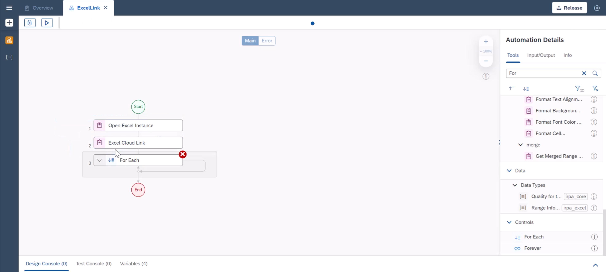

15. As a loop variable, you can add the **Output Parameter** from **Excel Cloud Link** activity
    <!-- border -->

16. Now you can print the customer name by adding **Log Message**. if you are using the sample data provided in this tutorial you can print **Order Number**
    <!-- border -->

17. Initially you add **Customer.name**
    <!-- border -->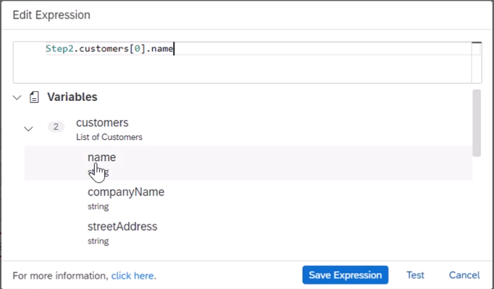

18. At first it takes 0-th index. You use **index** variable so for each loop iteration, it can print the corresponding value
    <!-- border -->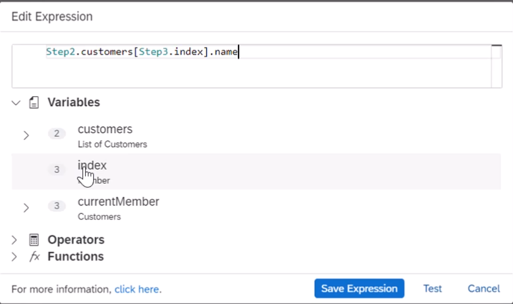

19. Add **Close Excel Instance** as you added **Open Excel Instance** in the first step
    <!-- border -->

20. Now you can test the output after saving the project.
    <!-- border -->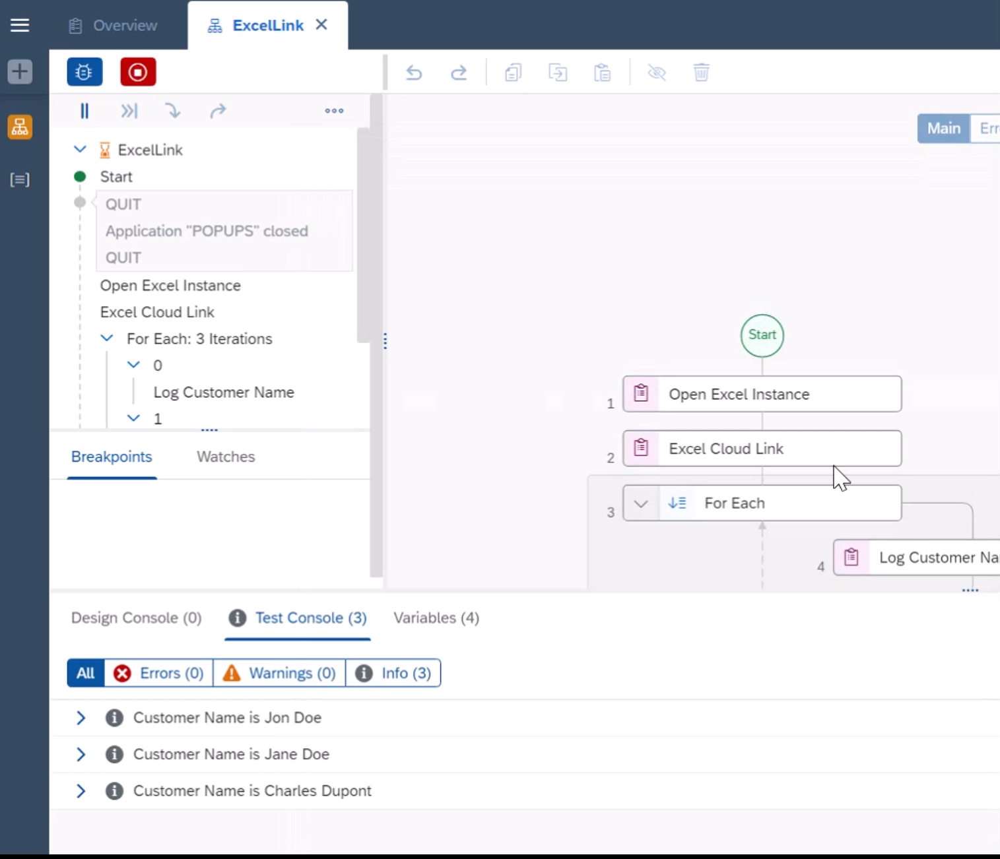

> - SAP Help Documentation [IRPA SDK V2] (https://help.sap.com/doc/b8b5c9bbac3846a0a57aedab3f412880/Cloud/en-US/modules/helper.html) on Excel Cloud Link
> - Excel Cloud Link [How to use the Excel Cloud Link activity helper](https://www.vimeo.com/458204726?embedded=true&source=video_title&owner=122956519)
> - Community [Quick automation with SAP Intelligent RPA – Excel SDK | SAP Blogs](https://blogs.sap.com/2021/05/31/quick-automation-with-irpa-Excel-sdk/) on Excel SDK

In the next step, you take a more traditional approach to process the Excel data.

### Process Excel Data

1. Let us start by adding new automation to the project and add **Open Excel Instance** to the flow.
  <!-- border -->

2. You create couple of string variables to create base folder and file name. from the activity search for **String** and add it to the flow.
  <!-- border -->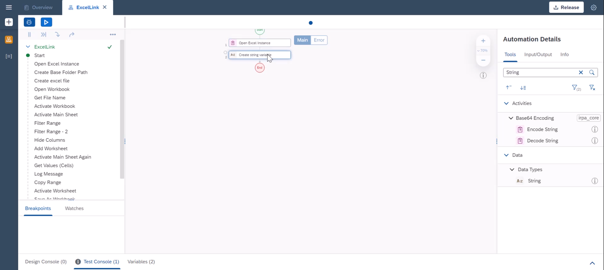

3. One of the Variable will point to the base `folder path` and the second variable will point to the `file name`. Creating them in this form, helps to use it in subsequent activity types.
  <!-- border -->

4. You call **Get File Name** activity to fetch the fileName. you can avoid this by creating a string variable for the file name.
  <!-- border -->

5. You add **Open Workbook** activity and point it to the full path (folder + file name) of the test Excel file. This will open the specific Excel file.
  <!-- border -->

6. Subsequently you activate the workbook and the first worksheet. Input for the activate work book activity is the file name from the previous step and the input of the activate worksheet activity is the first sheet name. You can use variables or hard coded values for now. If you are trying a different Excel, use these values appropriately.
  <!-- border -->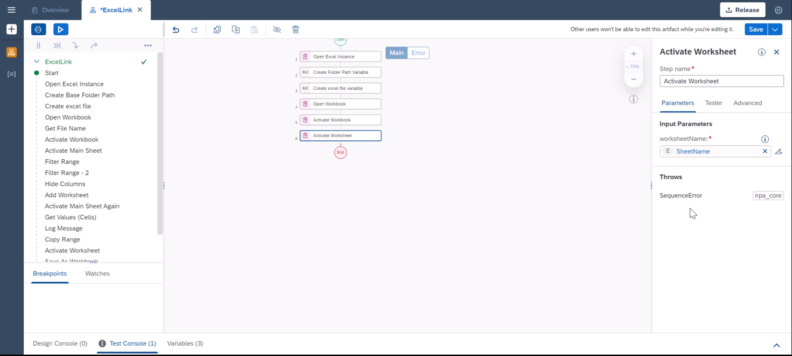

7. Now that Excel sheet is open, you can apply filters, hide columns or get values from a range of cells or add a new sheet and copy a range of values to the newly created sheet.
  <!-- border -->

8. You can add **Get Values (Cells)** to fetch specific range cells and subsequently you can validate the step using output parameter through `LogMessage`. The input to **Get Values (Cells)** can be a single cell or a range of Excel cells. When you use **Excel Cloud Link**, reading Excel data is pretty quick and simple. the traditional approach is in few steps.
  <!-- border -->

9.  Now Add **Filter Range** activity. In the **Filter Range**, you specify the data range, where the filter needs to be applied, along with the column on which the filter needs to apply with a filter condition.
You add a new Excel sheet to your workbook and copy this filtered data onto that. just for demonstration purpose.
    <!-- border -->

10. Subsequently you can add Hide column to hide a specific column in the result.
    <!-- border -->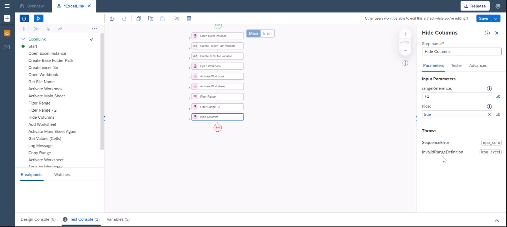

11. You copy the result of filter to a new sheet. For this you add a sheet through **Add Worksheet**  and give it a name **Result**.
    <!-- border -->

12. This will activate the new worksheet, but for us to copy from the filter results to this new sheet, you switch to the first sheet and copy its values.
    <!-- border -->

13. Add **Copy Range** activity and provide the source range, destination worksheet and workbook and starting cell for copy.
    <!-- border -->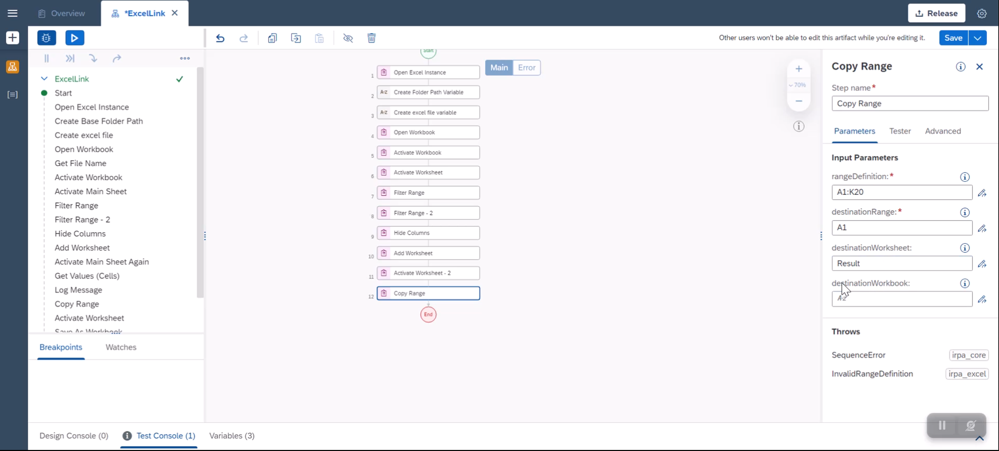

14. Activate the new sheet now, in order to save it.
    <!-- border -->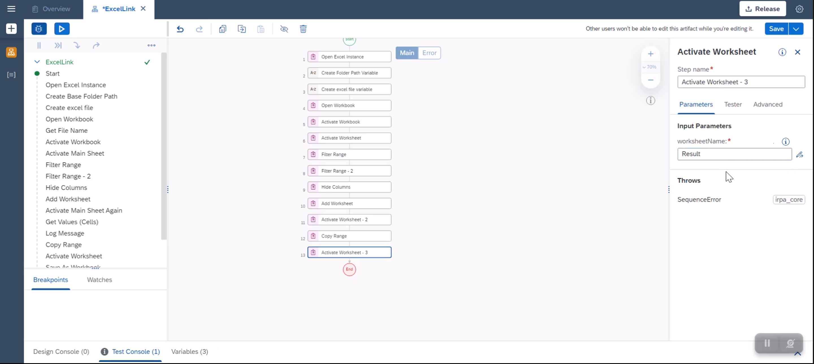

15. Now add **Save As Workbook** to save the new sheet as another file. You have option to save workbook as an Excel file or CSV file. In order to save as a new CSV file, you will be needing a file path to store this CSV file, This will be of the format `folderName` + `fileName` without extension where this needs to be saved.
    <!-- border -->

16. Finally you need to include **Close Excel Instance** to conclude the step.
    <!-- border -->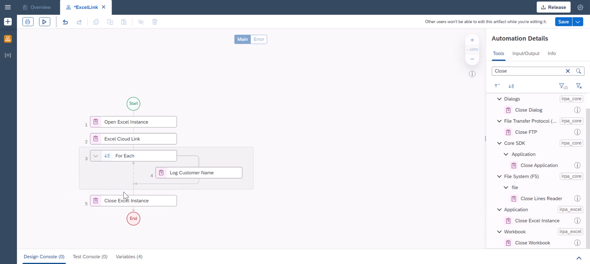

17. You can save the project and test it to validate the result.
    <!-- border -->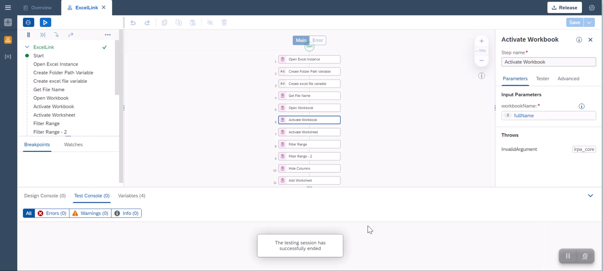

18. In the end, when this tutorial was tested, you used the below source data.
    <!-- border -->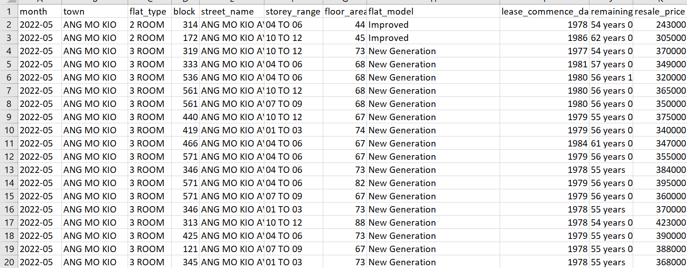

19. After Automaton is executed, it has filtered the data (Town starting with a), hide a column (Column F with title `storey_range`) and resultant Excel will look like this.
    <!-- border -->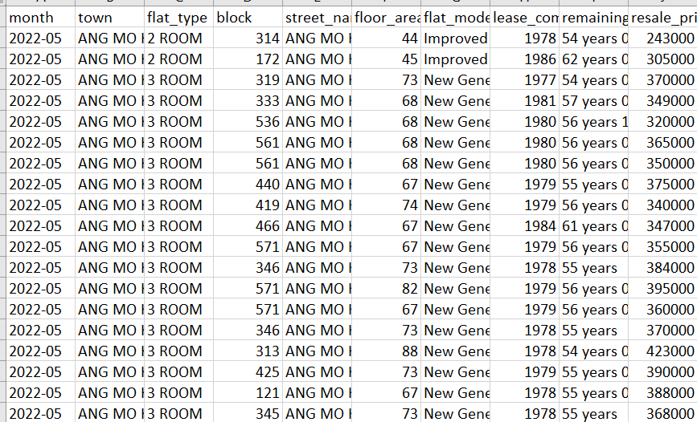

Excel SDK of SAP Process Automation offers wide variety of activities you can consider for business processes.

> Review the below resources:

> - Microsoft Excel Best Practices from the SAP Process Automation [documentation](https://help.sap.com/docs/IRPA/8e71b41b9ea043c8bccee01a10d6ba72/76d8129ef8984e4184294ae02b30ed58.html).
> - Excel Email Best Practices Automation from the [SAP Process Automation Store](https://irpa.store.sap.com/#/package/d4c960f9-30ba-4f20-b641-7de878f6f5d5)
