# Automate to Access Documents from Document Management Repository
<!-- description --> Automate to access and retrieve documents from DMS

## Prerequisites
 - Complete [Invoice Processing and Approval Using SAP Build Process Automation](mission.invoice-processing-approval-spa) mission
 - Configure[ Document Management Repository](https://help.sap.com/docs/PROCESS_AUTOMATION/a331c4ef0a9d48a89c779fd449c022e7/3da3846d0da94d96a4f38688cd2e936a.html?locale=en-US&version=Cloud)

## You will learn
  - How to download a document from DMS

---

### Create an automation to download a document from DMS


Once you have completed the [Invoice Processing and Approval Using SAP Build Process Automation](mission.invoice-processing-approval-spa) mission, your process looks like this:

<!-- border -->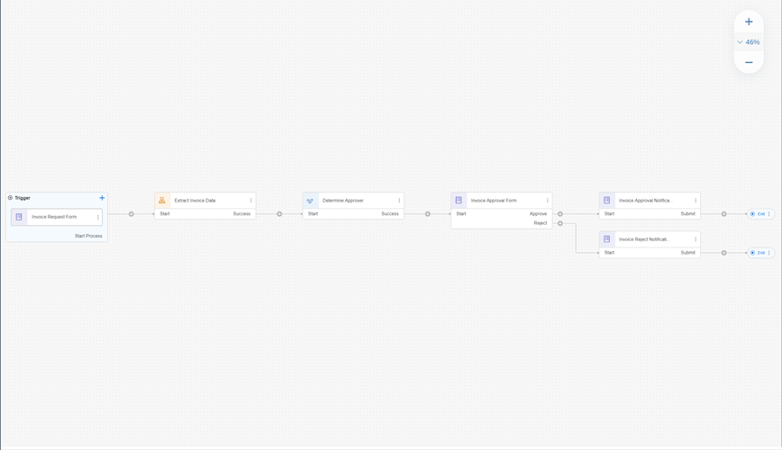

1. Choose the **+**, then **Automation**, then **+ New Automation** to add a new Automation to the process.

    <!-- border -->

2. In the **Create Automation** window, fill the fields as follows:


    |  Name     | Description
    |  :------------- | :-------------
    |  Download Document DMS | Download the document from Document Management Repository   

3. Choose **Create**.

    <!-- border -->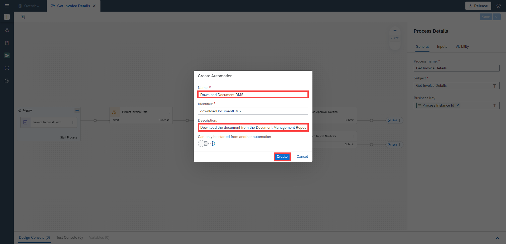

    A new automation is added to the process.

4. Double click on the automation to open the flow.

    <!-- border -->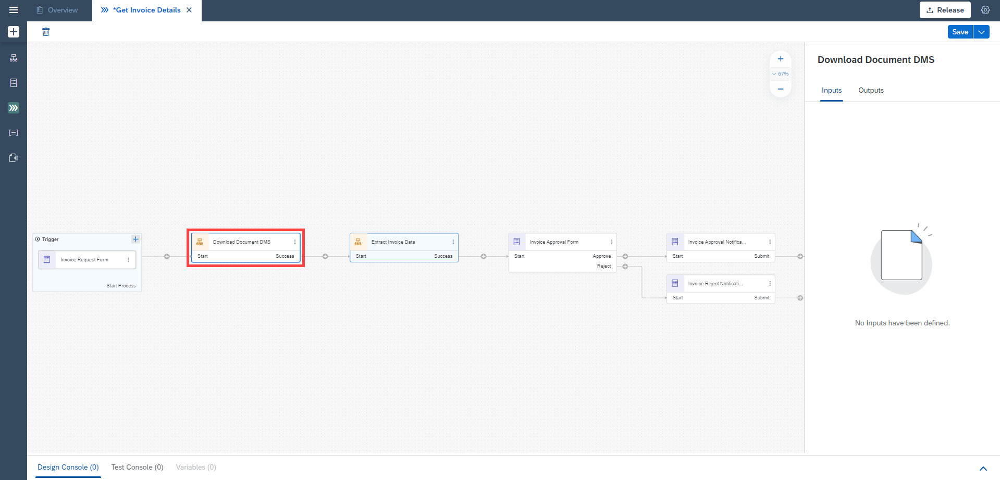


### Add Input Parameters to the Automation


1. Under the **Automation Details**, select **Input/Output**. Choose **Add new input parameter**.

    <!-- border -->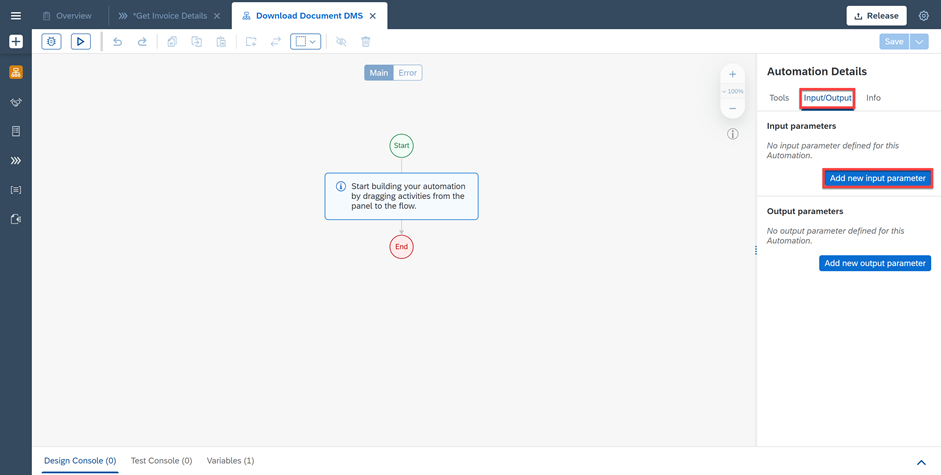

2. Create three input parameters with the following details:

    |  Name    | Type
    |  :------------- | :-------------
    |  `uploadedFileName`       | String
    |  `folderName`      | String
    |  `outputFilePath`  | String

    This is the result you should expect:

    <!-- border -->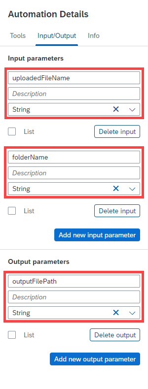

3. Save your work.


### Create environment variable


1. Choose **Manage the project properties**, then **Environment Variables**. Finally, select **+ Create**.

    <!-- border -->

2. In the **Create an environment variable** window, fill the fields as follows:

    |  Field Name     | Value
    |  :------------- | :-------------
    |  Identifier          | **`DocMgmt`**
    |  Type           | **`Destination`**


5. Choose **Close**.

    <!-- border -->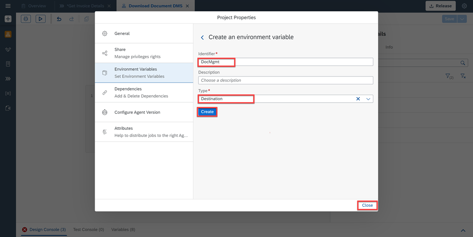


### Build automation to download document DMS


1. Select **Tools**.

2. Search for the data type **String**, and drag and drop it into the workflow.

    <!-- border -->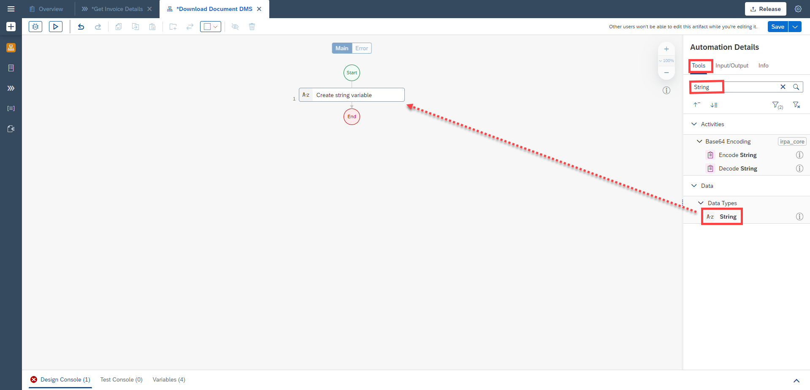

3. For output parameter set `myFilepath`, and Open the Expression Editor of the **value** parameter.

    <!-- border -->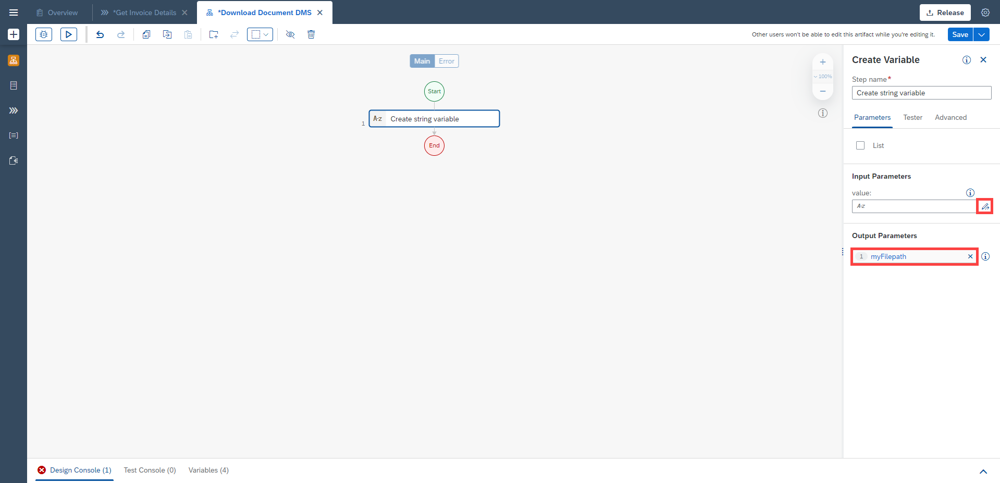

4. Copy and paste this expression and choose **Save Expression**:

    ```
"C:\\Users\\Public\\" + Step0.uploadedFileName
    ```

    <!-- border -->


5. Select **Tools**.

6. Search for the control **Try**, and drag and drop it into the workflow.

    <!-- border -->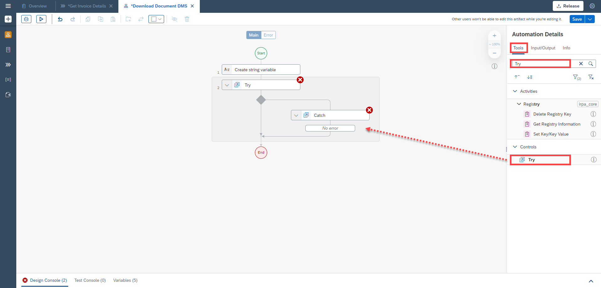

7. Choose the control and select `RequestError` as **Errors to catch**. Choose **Save**.

    <!-- border -->

8. Go back to the **Automation Details** panel.

    > To go back to the Automation Details panel, you can either close the step panel or click on the flow canvas.

9. Search for the **Log Message** activity. Now drag and drop it into the workflow, below the catch.

    <!-- border -->

10. Select the **Log Message** activity.

11. Open the Expression Editor of the **message** input parameter and choose **Variables>1 error>message**.

12. Choose **Save Expression**.

    <!-- border -->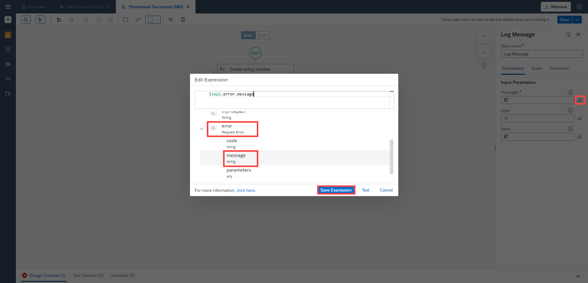

13. For the **type** input parameter select **Error**.

14. Open the Expression Editor of the **label** input parameter and select **Variables>1 error>parameters**. Choose **Save Expression**.

15. Choose **Save**.

    <!-- border -->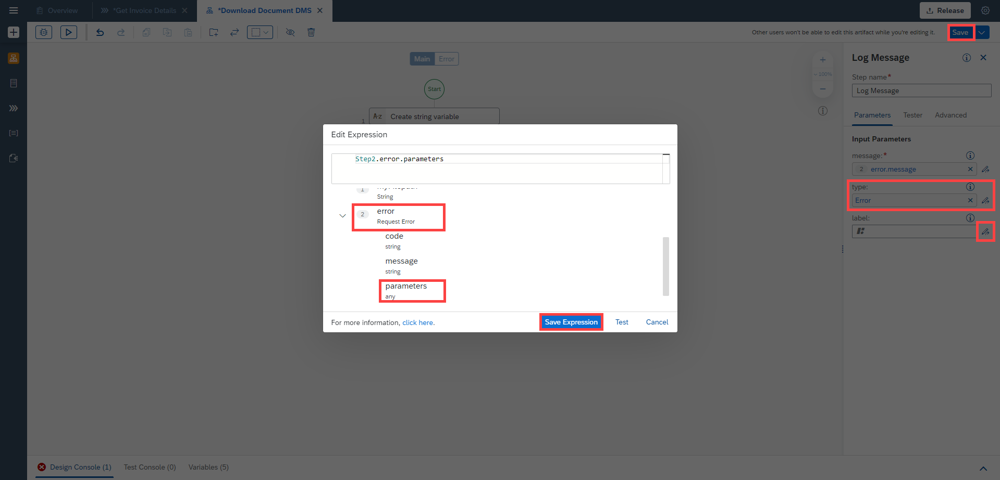

16. Search for the control **Custom script** and drag and drop it into the workflow below the **Try** control.

    <!-- border -->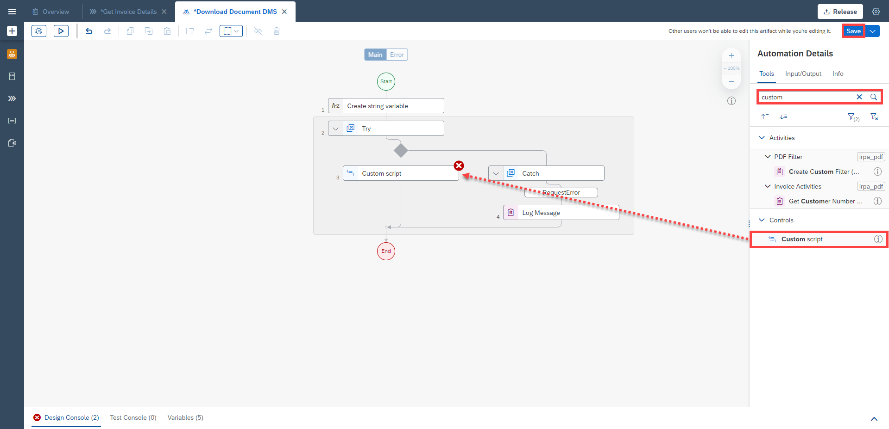

17. Choose the control and select **Edit Script**.

    <!-- border -->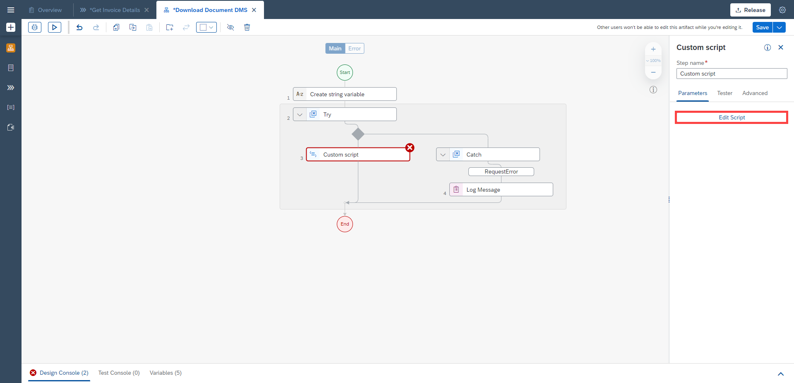

18. Copy and paste this script:

```
return {
    url : folderName ? folderName + '/' + uploadedFileName : uploadedFileName,
    method: 'GET',
    resolveBodyOnly: true,
    responseType: 'buffer'
};
```
19. Create the following **Input Parameters**:

    |  Name    | Type
    |  :------------- | :-------------
    |  `uploadedFileName`        | String
    |  `folderName`         | String

    <!-- border -->

20. Create the following **Output Parameter**:

    |  Name    | Type
    |  :------------- | :-------------
    |  options        | Any

21. Save your work and close the panel.

    <!-- border -->

22. For the **Input Parameters**, select `uploadedFileName` and `folderName`.

    <!-- border -->

23. Go back to the **Automation Details** panel.

    > To go back to the Automation Details panel, you can either close the step panel or click on the flow canvas.

24. Search for the HTTP Request: **Call Web Services with Destinations**. Drag and drop the request into the workflow, just below the **Custom script** control. Save your work.

    <!-- border -->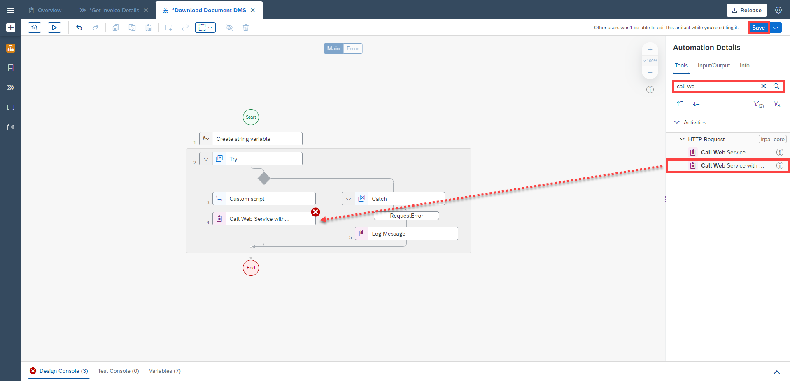

    > This activity is used to create and send an HTTP request to call a remote service (API call for instance) represented through a destination.

25. Under **Input Parameters**, as **destination** select `E DocMgmt` and as **options** select `2 options`.

    > The environment variable created in step 3 will be consumed here.

    <!-- border -->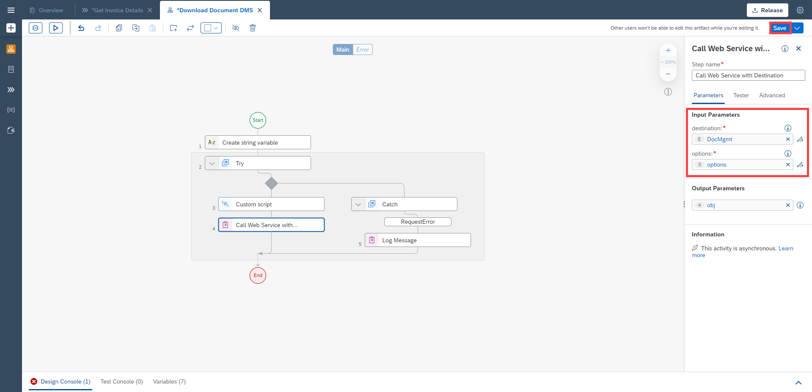

26. Go back to the **Automation Details** panel.

    > To go back to the Automation Details panel, you can either close the step panel or click on the flow canvas.

27. Search for another **Try** control. Drag and drop the control into the workflow, just below the **Call Web Services with Destinations**. Save your work.

    <!-- border -->

28. Select the control. Choose **Error** as the **Error to catch**. Save your work.

    <!-- border -->

29. Go back to the **Automation Details** panel.

    > To go back to the Automation Details panel, you can either close the step panel or click on the flow canvas.

30. Search for the **Custom Script** control. Drag and drop the control into the workflow under the **Try-2** control. Save your work.

    <!-- border -->

31. Select the control.

32. Change step name to **Convert binary to string**. Choose **Edit Script**.

    <!-- border -->

33. Copy and paste the following code:

    ```return
    buffer.toString('binary');
    ```

34. Create Input and Output parameters as per screenshot below:

    <!-- border -->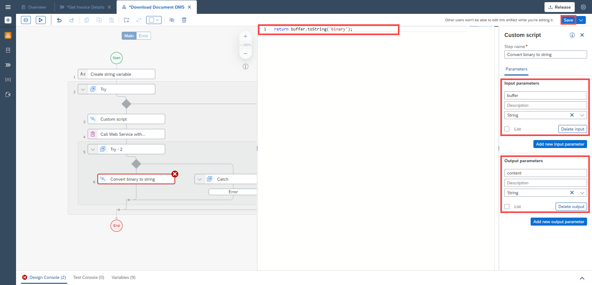

35. Save your work.

36. Under **Input Parameters**, select `3 obj` as **buffer**. Save your work.

    <!-- border -->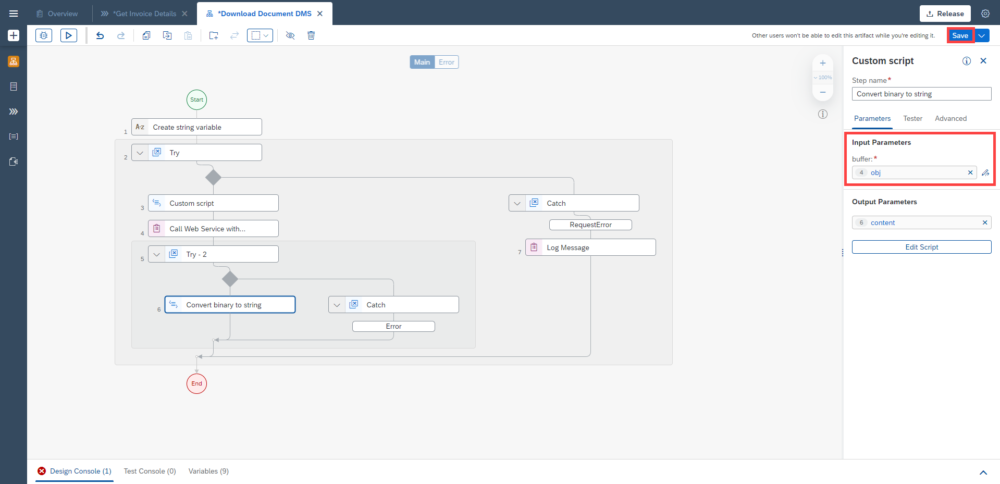

37. Click on the canvas to back to the **Automation Details**.

38. Search for the file **Write File**. Drag and drop the file into the workflow, under the custom script.

    <!-- border -->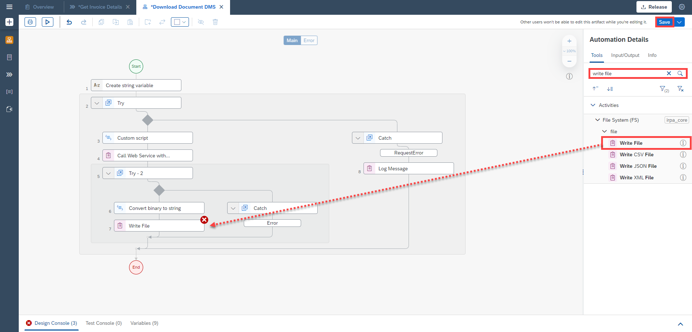

39. Choose the **Write File**. Fill in the different **Input Parameters** as per screenshot below:

    <!-- border -->

40. Click on the canvas to back to the **Automation Details** panel.

41. Search for the **Log Message** activity. Drag and drop it into the workflow, below the second catch.

    <!-- border -->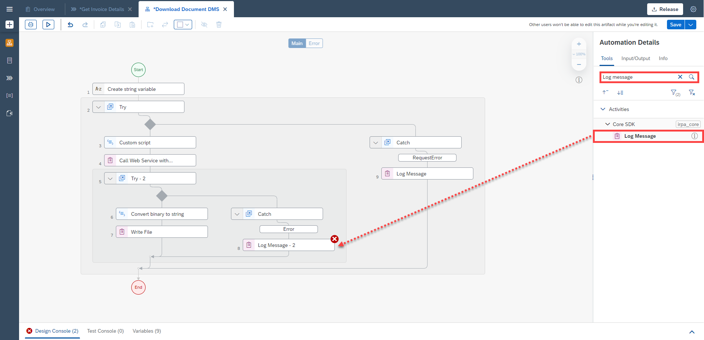

42. Select the **Log Message** activity. Open the Expression Editor. Choose **Variables>4 error>message**. Choose **Save Expression**.

    <!-- border -->

43. For the **type** parameter select **Error** and for the **label** parameter select **4 error**.

    <!-- border -->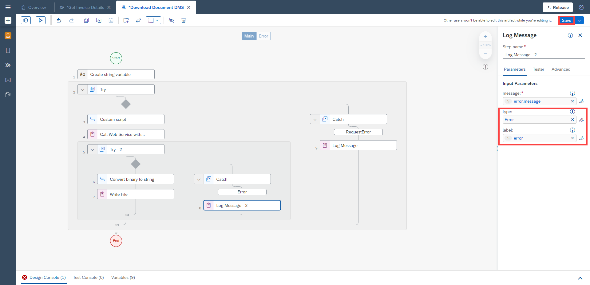

42. Select the **End** automation node. Set the `outputFilePath` parameter with `myFilepath`. Check the **Design Console** if your automation is free of errors. Save your work.

    <!-- border -->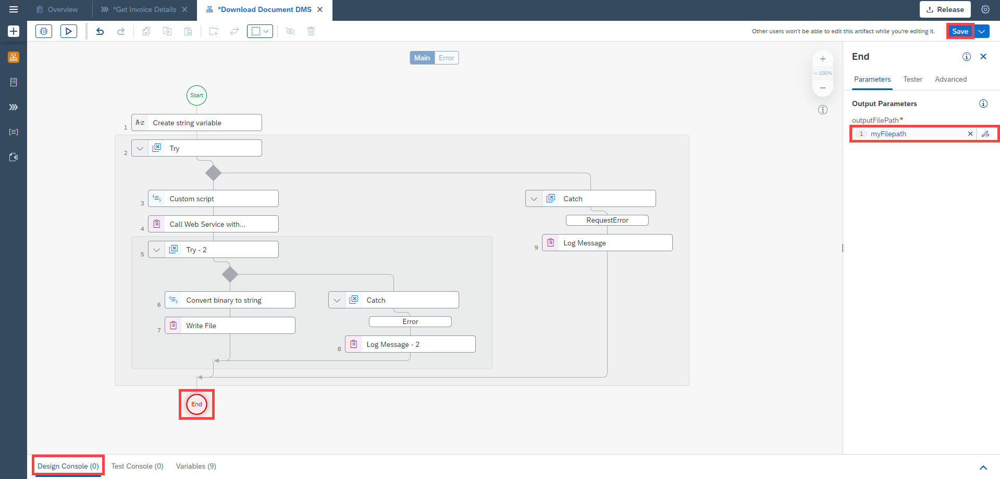


---
