# Create Forms for Invoice Approval Process
<!-- description --> Create the needed approval and notifications forms for the Invoice Approval Process

## Prerequisites
 - Created the [trigger](spa-dox-create-process), the [automation](spa-dox-create-automation) and also the [decision](spa-dox-create-decision) to come to this point in the process

## You will learn
   - How to leverage the result of the Decision in an approval form
   - How to create an approval form
   - How to create forms to notify process participants

## Intro
There are different requirements and business situations when a form is needed in a business process. You have already created a form to start the process. Most often you probably need a form to maintain some input data or to approve or reject a request or even to send out some notifications. The two latter ones are your focus now.

---

### Create new approval form

1. Choose **+** at the connection flow after the decision **Determine Approver** to open the context menu. Then select **Approvals > New Approval Form**.

    <!-- border -->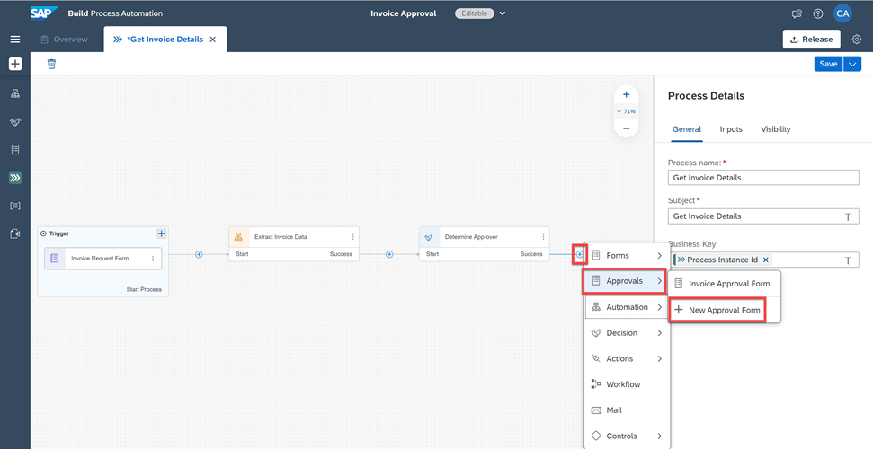

2. Maintain the **Name** **`Invoice Approval Form`** and also the **Description** **`Form to approve the invoice`**. Choose **Create**. The **Identifier** is created automatically.

    <!-- border -->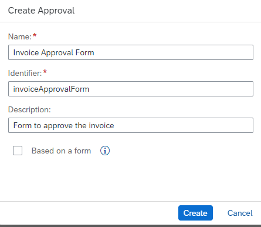

3. Choose the three dots on the created form's artifact and select **Open Editor** to do the same. Just ignore the red frames, you will fill them later.

    <!-- border -->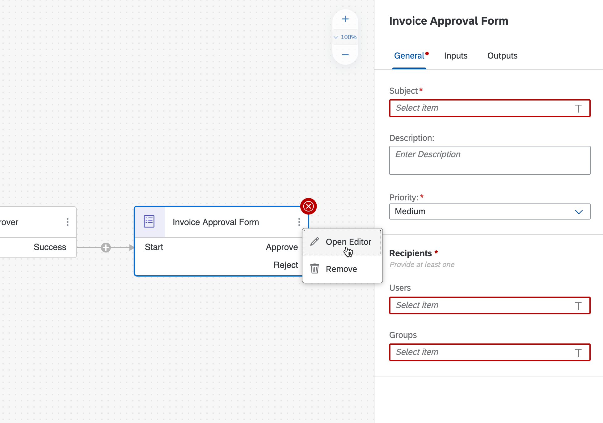

4. Now you are in the Form's Editor, where you can define the layout and input fields. First add via drag and drop a new **Headline 1** into the canvas.   Provide this headline **`Invoice Approval`**.

    <!-- border -->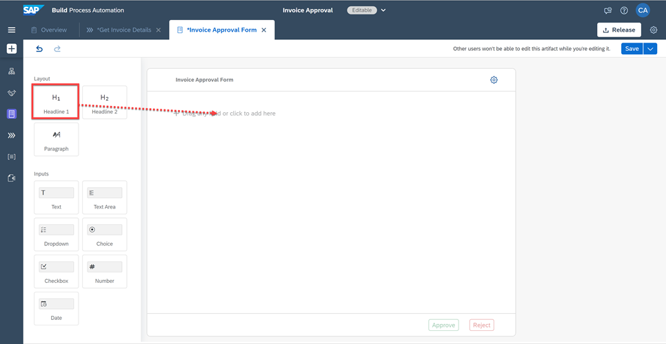

5. Drag and drop a **Paragraph** into the canvas. Insert **`Invoice Details`** in the paragraph.

    <!-- border -->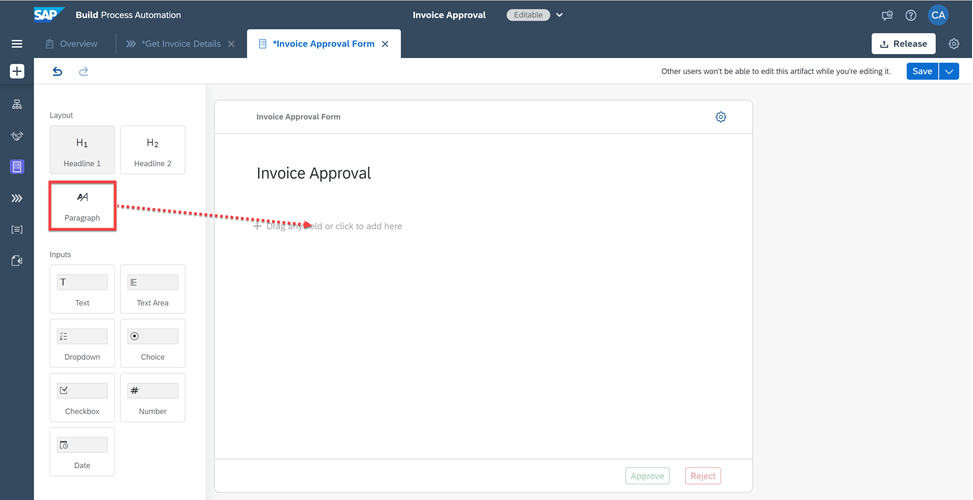

6. Include a **Text** field in your form.

    <!-- border -->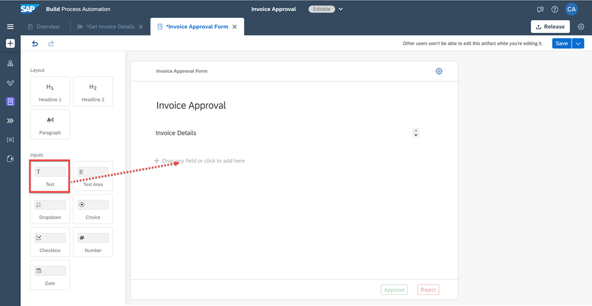

7. Change the name to **`Company Name`** and select **Read Only**, as you will display here some information from the process content.

    <!-- border -->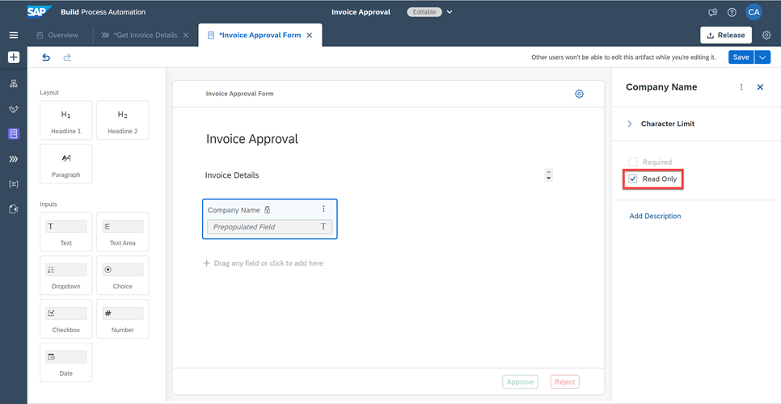

8. Add some further input fields to your form. Please ensure you have selected the correct type and also maintain all of them as **Read Only**.

    |  Field Type    | Name
    |  :------------- | :-------------
    |  Text          | **`Invoice Number`**
    |  Number           | **`Gross Amount`**
    |  Text   | **`Employee Name`**

9. You are done with the layout and input fields of the approval form. **Save** your work.

    <!-- border -->

10. Go back to your process, you will recognize some errors, e.g. inputs are missing. No need to worry, you will provide the required details in the next steps.

    <!-- border -->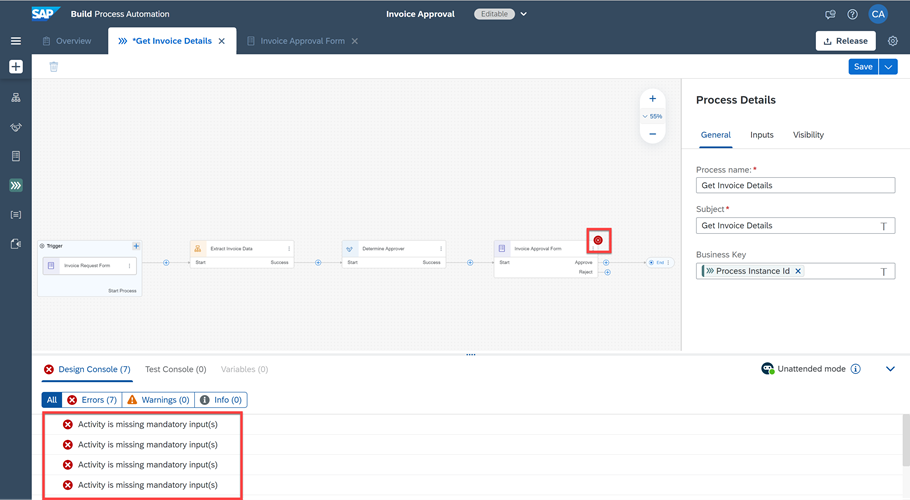

11. Select the **Invoice Approval Form** and in the **General** tab of the form properties, move to **Subject** and choose **Select Item**.

    <!-- border -->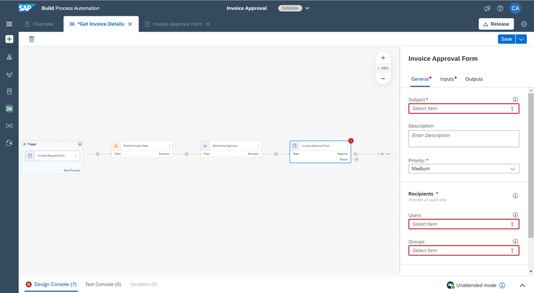

12. Enter the text **`Please approve the invoice`** and add the process content **Document Number**. You will find this underneath **Invoice Details**. This combines plain text with process-related information and serves as an unique identifier for the end user.

    <!-- border -->

13. In the Decision you have defined the approver of the invoice. The output of the decision has been an email address. Now add from the process content within **`Approver_Output`** the **eMail** in the **Recipients** as **Users**. This means only the selected approver will get this approval in the inbox.

    <!-- border -->

14. Switch to the **Inputs** tab and within **Employee Name** choose **Select Item**. The process content will open again.

    <!-- border -->

15. Now add the attributes from the process content to the related input fields.

    > You can only assign fields with the same type, e.g. text in the process content to text input field.
     If you cannot assign, e.g. Invoice Number from the process content to the Invoice Number in the input field, the type of the input field might be wrong. If so, please correct your form.

    |  Process Content    | Input Field
    |  :------------- | :-------------
    |  Employee Name          | Employee Name
    |  Sender Name           | Company Name
    |  Gross Amount    | Gross Amount
    |  Document Number          | Invoice Number

    <!-- border -->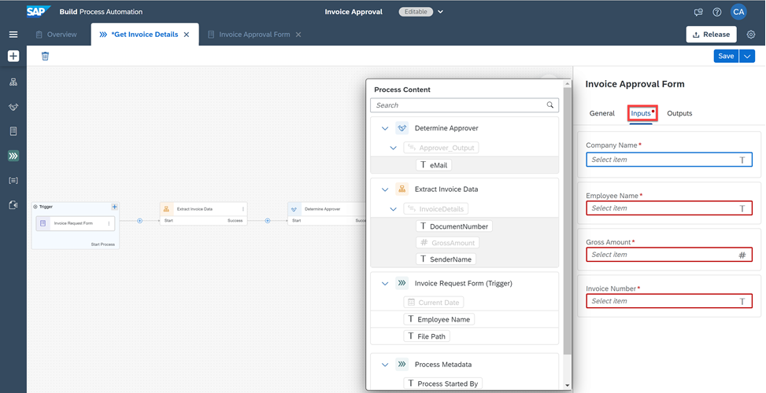

16. As this mapping of process content and forms is quite important to ensure a proper flow of the relevant data in your process, please check them again. It should look like this.

    <!-- border -->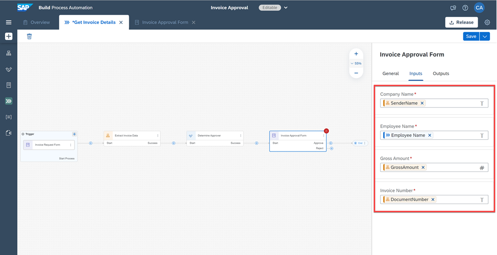

17. **Save** your work.

### Create approval notification form

1. Choose the **+** of the control flow for **Approve** coming from the **Invoice Approval Form** you have just created. In the context menu, select **Forms > New Form**.

    <!-- border -->

2. Maintain the **Name** **`Invoice Approval Notification Form`** and also the **Description** **`Form to notify about the approved invoice`** and choose **Create**. As always, the **Identifier** has been created automatically.

    <!-- border -->

3. In the newly created **Invoice Approval Notification Form**, choose the three dots and select **Open Editor**.

    <!-- border -->

4. In the form, add a headline **`Invoice Approval`**, a paragraph **`Your invoice has been approved.`** and also a text field **`Invoice Number`** and select here **Read Only**. **Save** your work.

    <!-- border -->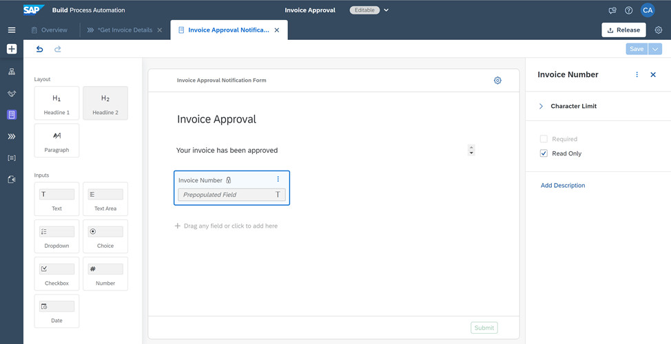

5. Go back to the process, select **Invoice Approval Notification Form** to maintain the information in **General** tab.

    <!-- border -->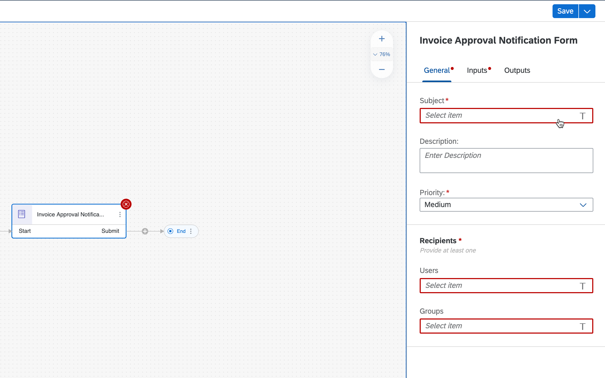

6. Maintain **Subject**, choose **Select Item** and type **`Approved Invoice:`** and add the process content **Document Number**.

7. Select for the **Users** in this case **Process Started By** from the process content.

    <!-- border -->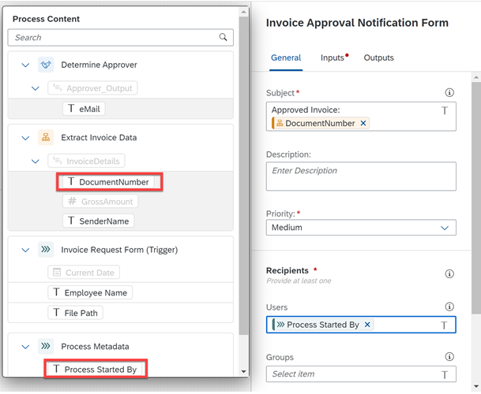

8. Select **Inputs** tab and assign the **Invoice Number** from the process content here.

    <!-- border -->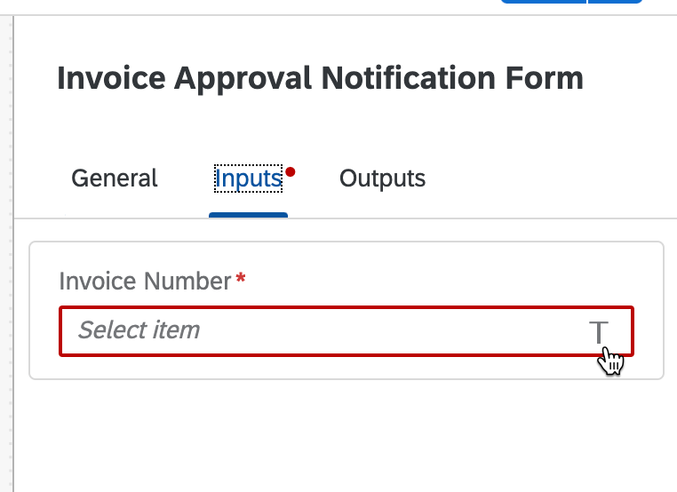

9. **Save** your work.

### Create rejection notification form

With this you completed designing and configuring the notification form. You can copy the same form to create another form to send a rejection notification to the requester.

> If copy is not available then create the form in the same way and modify the texts wherever relevant as shown below.

To add the new rejection form, you will use the **Duplicate** feature.

**Duplicate** feature is used to copy artifacts within the Business Process whereas **Copy** feature is used to copy artifacts across the business processes.

1. Click on the **Overview**.

    <!-- border -->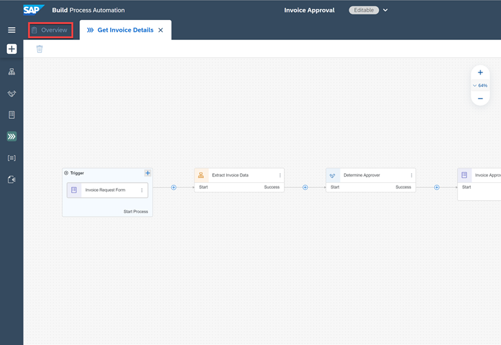

2. In the **Overview** screen, do the following:
    - Find **Invoice Approval Notification Form** under the **Artifacts** section and click on **...**.
    - Choose **Duplicate**.

    <!-- border -->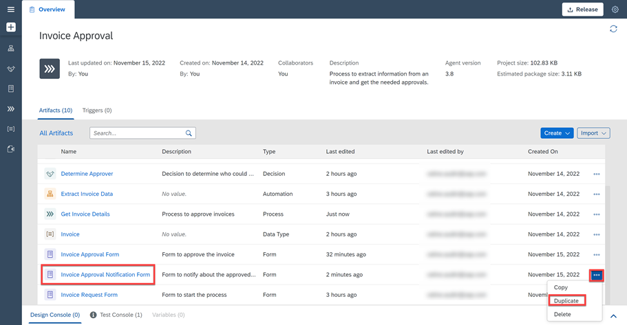

3. The duplicate artifact pop-up will appear.

    <!-- border -->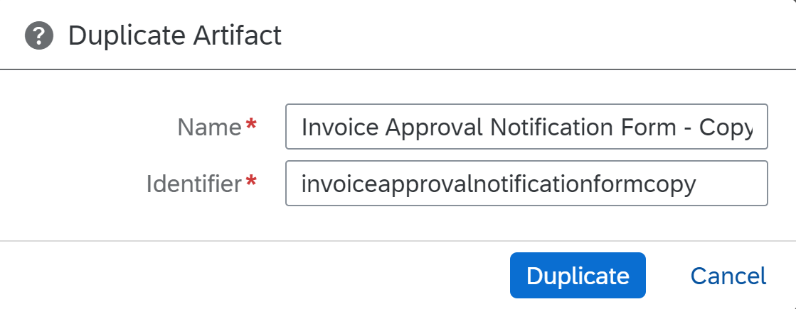

4. Change the name to **`Invoice Reject Notification Form`** and click **Duplicate**.

    <!-- border -->

5. The **`Invoice Reject Notification Form`** is automatically opened in the form builder.

    The screen shown will be the same as **`Invoice Approval Notification Form`**.

    <!-- border -->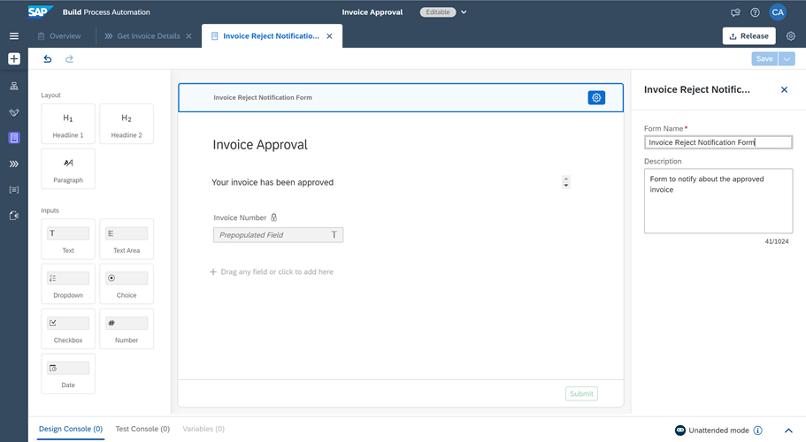

6. Change the invoice rejection form in the form builder to reflect the data for rejection case.

7. Change the **Description** to **`Form to notify about the rejected invoice`** and the following fields to:

    | Form Fields | Field Settings with Label
    |  :------------- | :-------------
    | Headline 1 | Invoice Rejection
    | Paragraph  | Your invoice has been rejected

8. Keep the text field **`Invoice Number`** and **Save** your work.

    <!-- border -->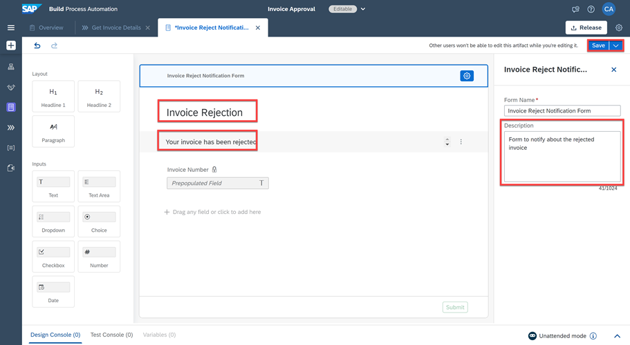

9. Go back to the process builder and add the invoice rejection notification form to the process.

       - Select **Invoice Approval Form** and Choose **+** option for the **Reject**
       - Choose **Forms** and select **Invoice Reject Notification Form**

       <!-- border -->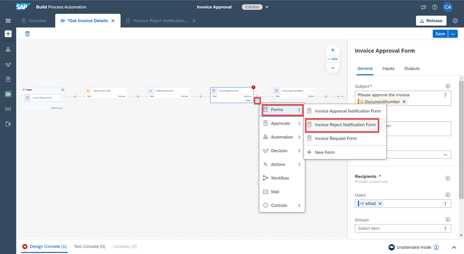

10. Select **Invoice Reject Notification Form** to maintain the information in **General** tab.

    <!-- border -->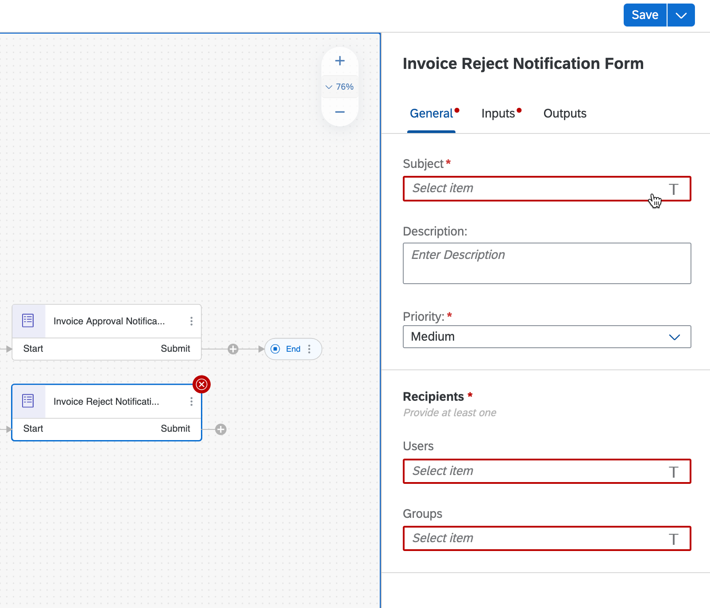

11. Maintain **Subject**, choose **Select Item** and type **`Rejected Invoice:`** and add the process content **Document Number**.

12. Select for the **Users** in this case **Process Started By** from the process content.

    <!-- border -->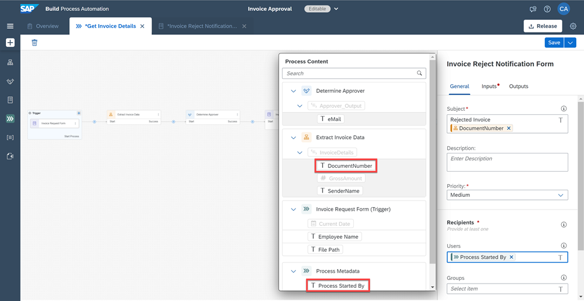

13. Select **Inputs** tab and assign the **Invoice Number** from the process content here.

    <!-- border -->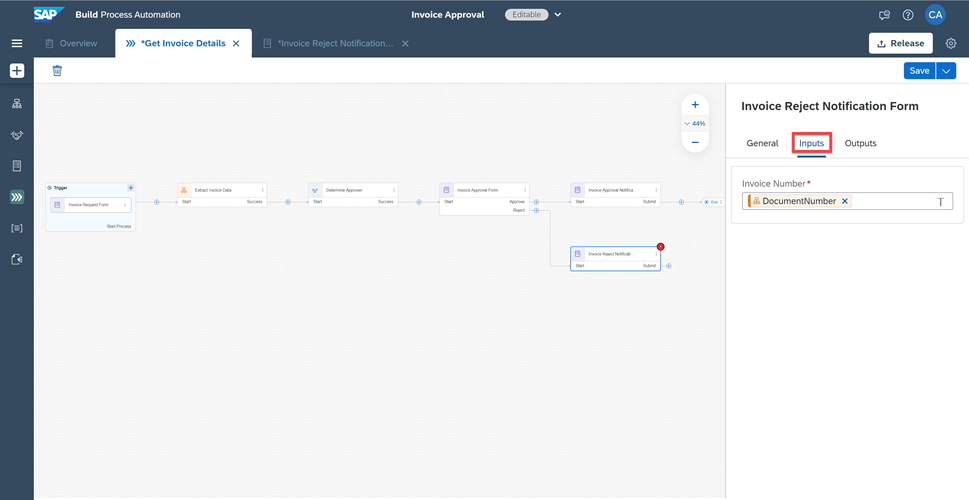

14. Add an end event, choose the **+** of the control flow from the **Invoice Reject Notification Form** and select **Controls > End**.

    <!-- border -->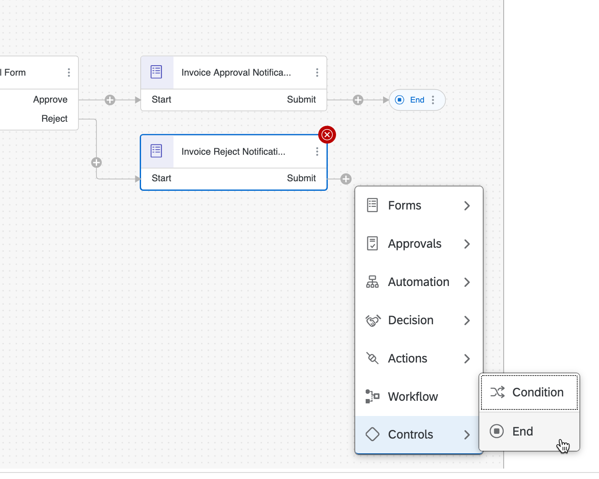

15. Your process is ready to be released, deployed and executed. **Save** your work.

    <!-- border -->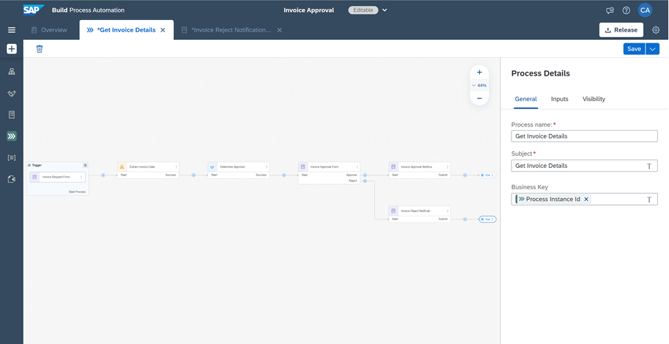

---
