# Run a Business Process from the Launchpad
<!-- description --> Configure a form trigger in the SAP Launchpad to run a Business Process

## Prerequisites
 - Complete [Configure Launchpad](spa-configure-launchpad) tutorial

## You will learn
  - How to configure your form trigger as a tile in the SAP Launchpad Service.

---

### Configure the Process Trigger

You completed [Configure Launchpad](spa-configure-launchpad) tutorial. You assigned **My Inbox**, **Process Workspace**, **Visibility Scenario Dashboard** and **Visibility Scenario Instances** to **Everyone** role and clicked **Save**.

<!-- border -->

1. Go back to **My Content** page.

    <!-- border -->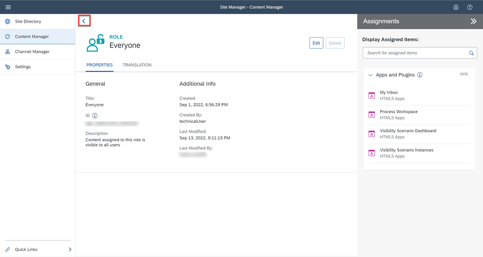

2. Choose **Process Trigger**.

    <!-- border -->

2. Choose **Create a Local Copy**.

    <!-- border -->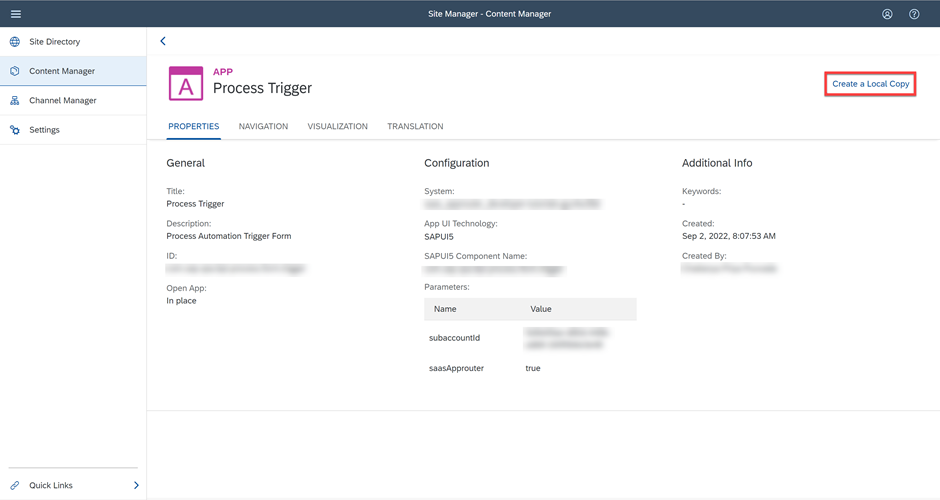

3. Choose **Edit** to make changes to the **Process Trigger** app.

    <!-- border -->

4. Change the name of the app to **Sales Order Management**.

    <!-- border -->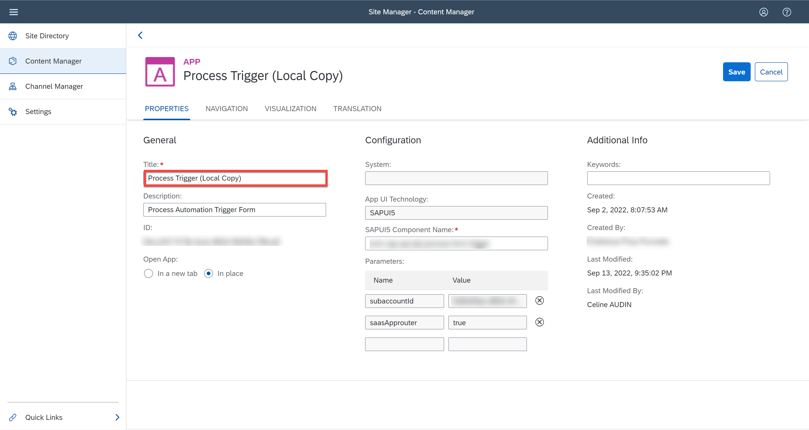

5. Select the tab **Navigation**.

    <!-- border -->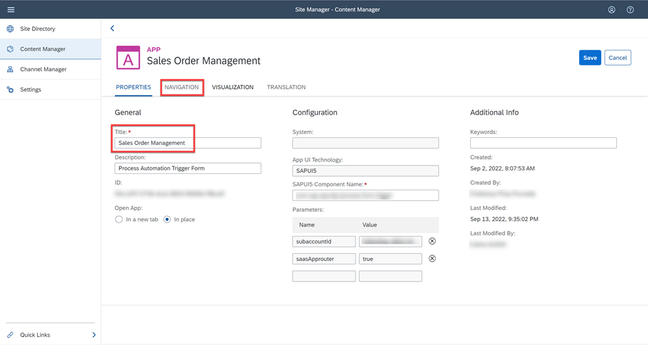

6. Now you need to fill the **Default Value** of the app's parameters with the **Launchpad Configuration Parameter** of your process's **Trigger Settings**.

    <!-- border -->

7. Navigate back to your deployed project in the **Application Development**.

8. Select the **Start Process**.

9. Copy the **Launchpad Configuration Parameter**.

    <!-- border -->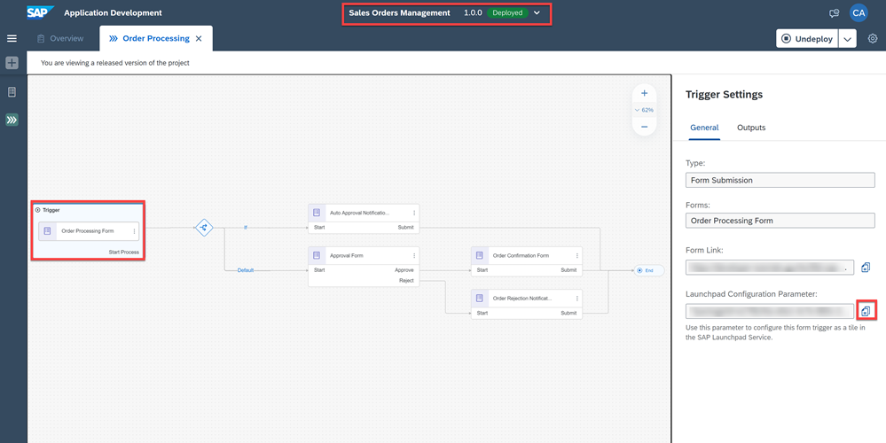

    >This is the parameter you need to configure this form trigger as a tile in the SAP Launchpad Service.

10. Now navigate back to the Launchpad.

11. Paste the value in the **Default Value** field of the Sales Order Management app's parameters.

    <!-- border -->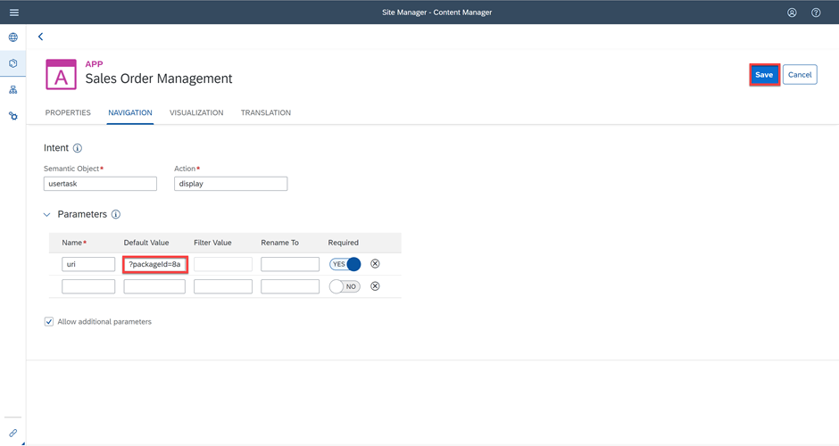

12. Select the tab **Translation**.

13. Change the name of the **Title** to **Sales Order Management**.

    <!-- border -->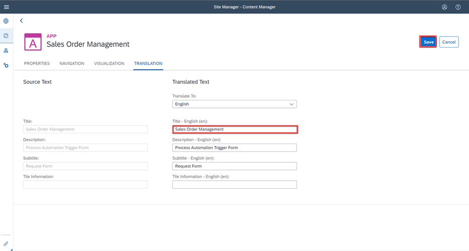

12. Choose **Save**.

### Assign Sales Order Management Trigger to SAP Build Process Automation Group

1. Navigate back to **My Content**.

    <!-- border -->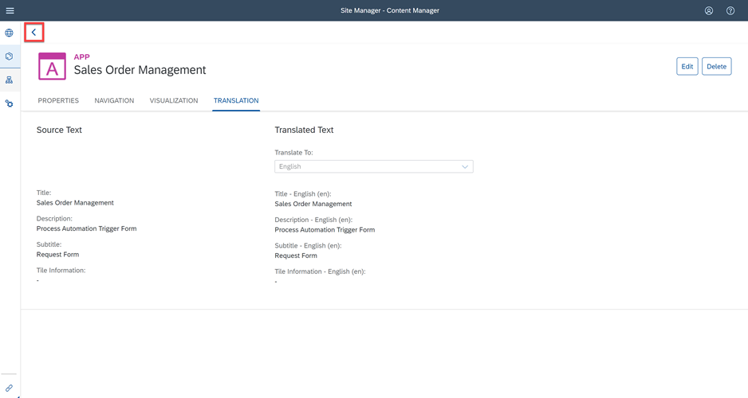

2. Select **SAP Build Process Automation** group.

    <!-- border -->

3. Choose **Edit** to make changes to the group.

    <!-- border -->

    You will now assign the **Sales Order Management** trigger to your group.

4. Select the search bar.

5. Choose the **+** to add the **Sales Order Management** item.

6. Choose **Save**.

    <!-- border -->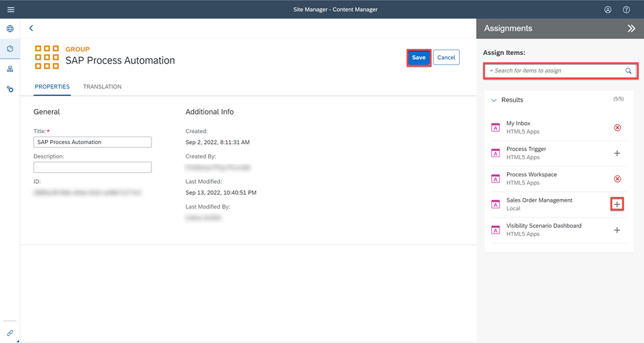

### Assign Sales Order Management Trigger to Everyone Role

1. Go back to **My Content**.

    <!-- border -->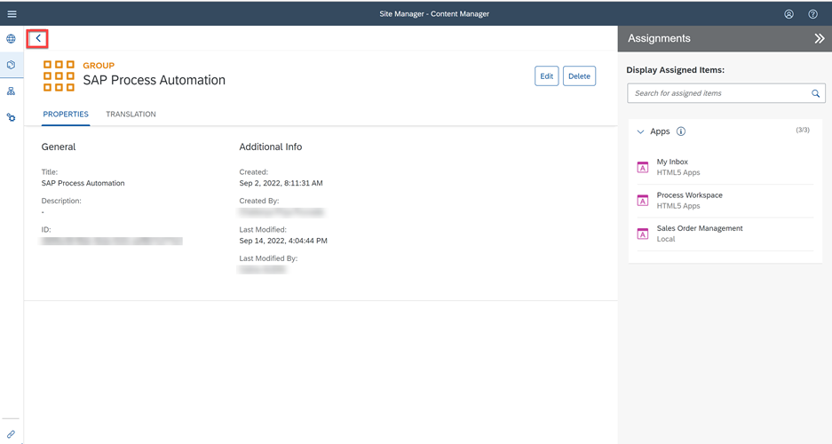

2. Choose **Everyone**.

    <!-- border -->

3. Choose **Edit**.

4. You will now assign the **Sales Order Management** trigger to Everyone role.

5. Select the search bar.

6. Choose the **+** to add the **Sales Order Management** item.

7. Choose **Save**.

    <!-- border -->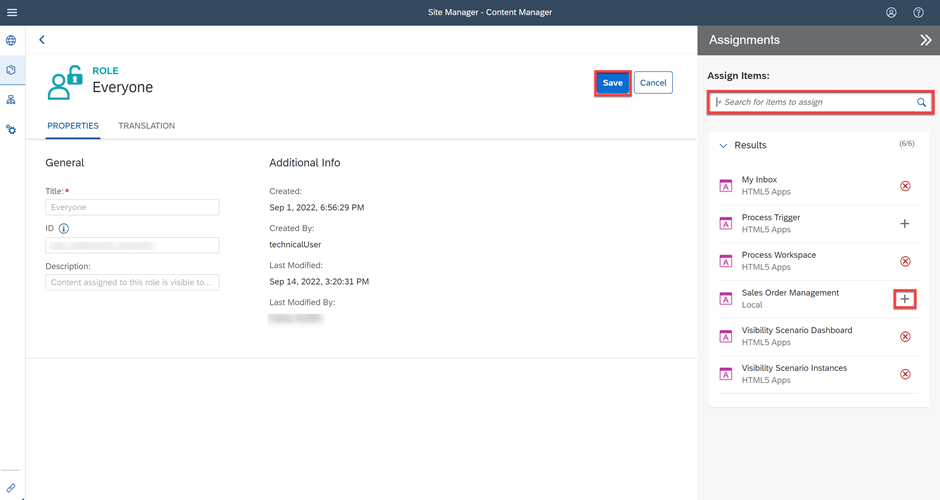

### Launch Site

1. Navigate back to the **Site Directory**.

    <!-- border -->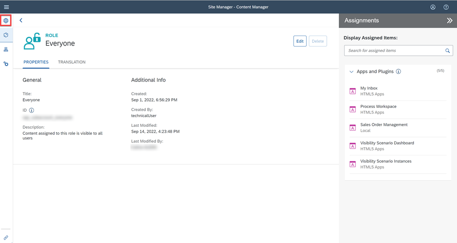

2. Go to the site.

    <!-- border -->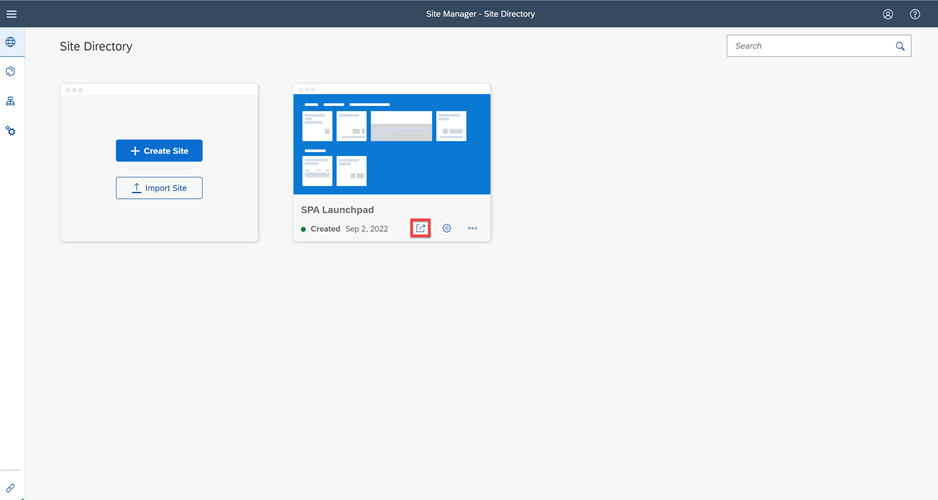

    You will be directed to the Launchpad where the Sales Order Management tile has been created.

    You can now trigger the process from the launchpad.

3. Choose **Sales Order Management** tile.

    <!-- border -->

    > You can also see `MyInbox` and Process Workspace tiles added to the launchpad which can be used by the business users to access the tasks and monitor the processes respectively.

    You will be redirected to the **Order Approval Request Form**.

    <!-- border -->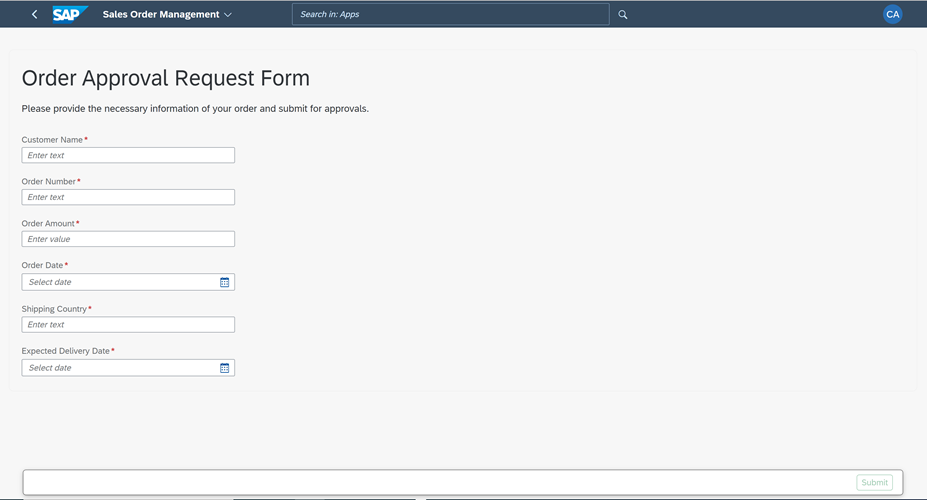

---
